# Готовый материал для диплома

Файл собран в порядке структуры диплома. Каждый раздел содержит диаграмму
и сразу под ней — таблицу (или таблицы), относящиеся к ней.

**Как вставлять в Word:**
1. Открой этот файл на GitHub (он отрендерится как HTML).
2. Скопируй нужную таблицу — она вставится в Word с форматированием.
3. Картинки — сохрани из `diagrams/` или скопируй прямо из браузера.

---

## 1.4. Разработка спецификаций

### 1.4.1. Диаграмма вариантов использования

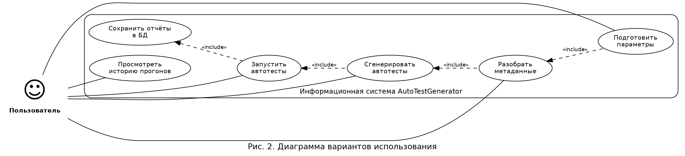

### 1.4.5. ER-диаграмма базы данных

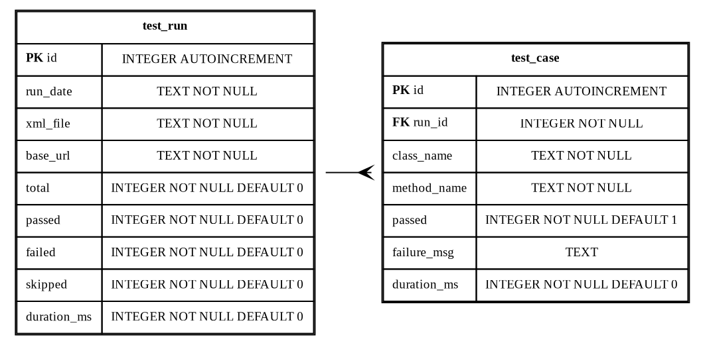

### 1.4.6. Диаграмма переходов состояний

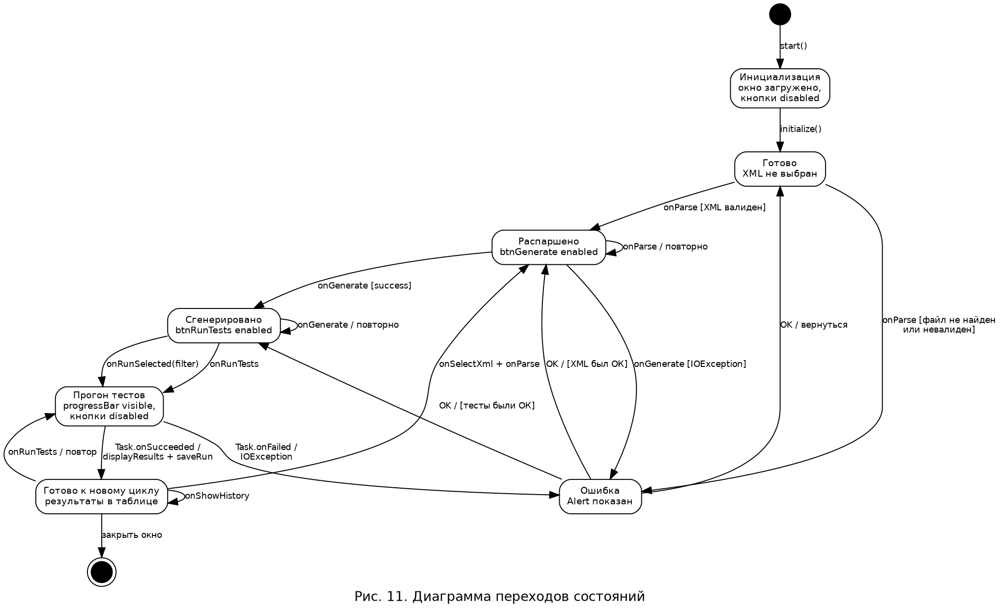

---

## 1.5. Проектирование программного обеспечения

### 1.5.1. Диаграмма пакетов

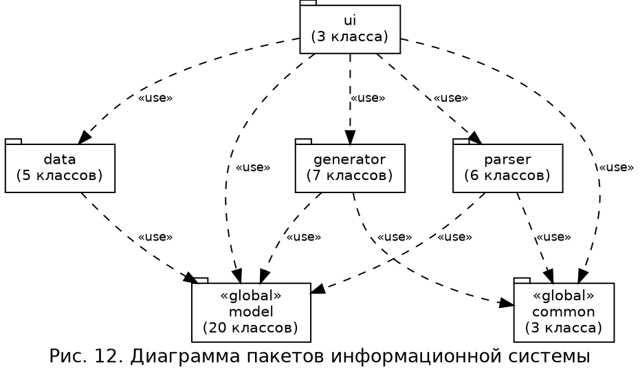

---

### 1.5.2. Проектирование классов в пакетах

#### 1.5.2.1. Пакет «UI»

##### Исходная диаграмма классов
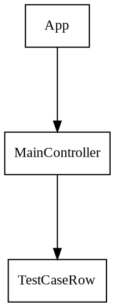

**Таблица. Описание классов пакета «UI»**

| Класс                         | Описание                                                                                                                                            |
| ----------------------------- | --------------------------------------------------------------------------------------------------------------------------------------------------- |
| `App`                         | Главный класс JavaFX-приложения, наследник `javafx.application.Application`. Загружает FXML-разметку, создаёт сцену и запускает GUI.                |
| `MainController`              | FXML-контроллер главного окна. Связывает элементы интерфейса с обработчиками и координирует вызовы парсера, генератора, раннера и DAO.              |
| `MainController.TestCaseRow`  | Вложенный статический класс — строка таблицы результатов тестов (5 неизменяемых полей).                                                              |

##### Диаграммы последовательностей

**Нормальный ход событий:**
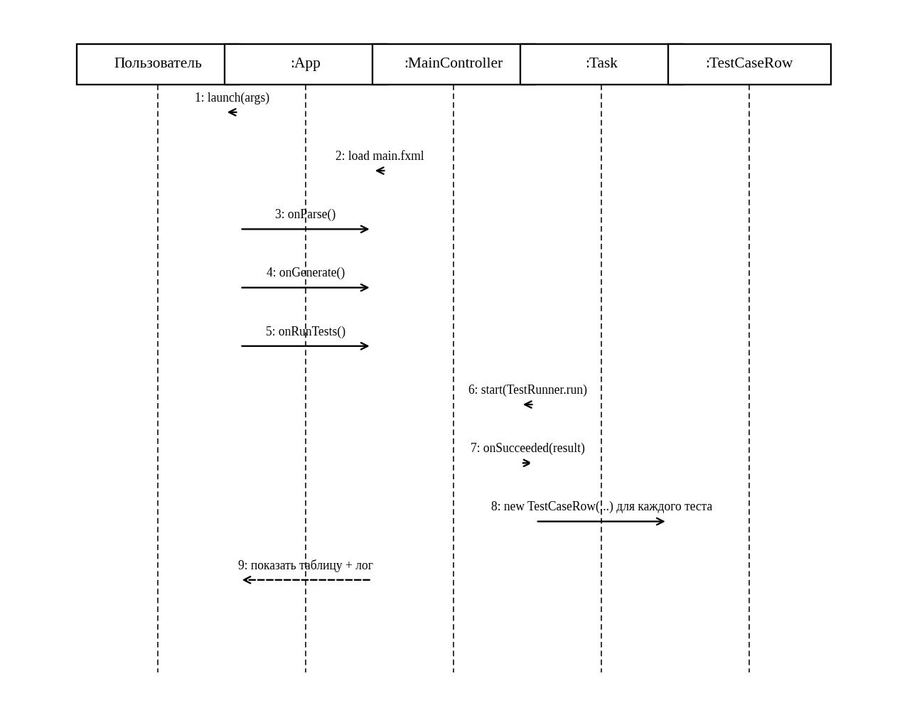

**Прерывание пользователем:**
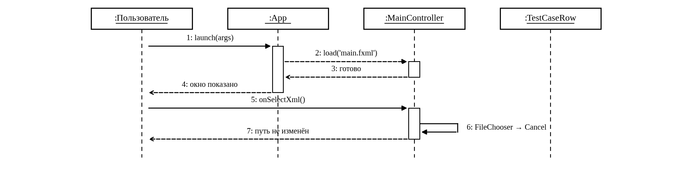

**Прерывание системой:**
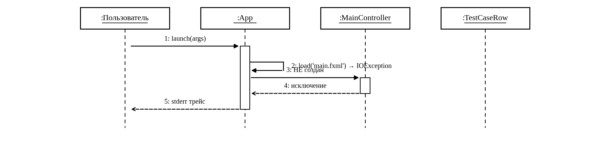

##### Диаграмма кооперации
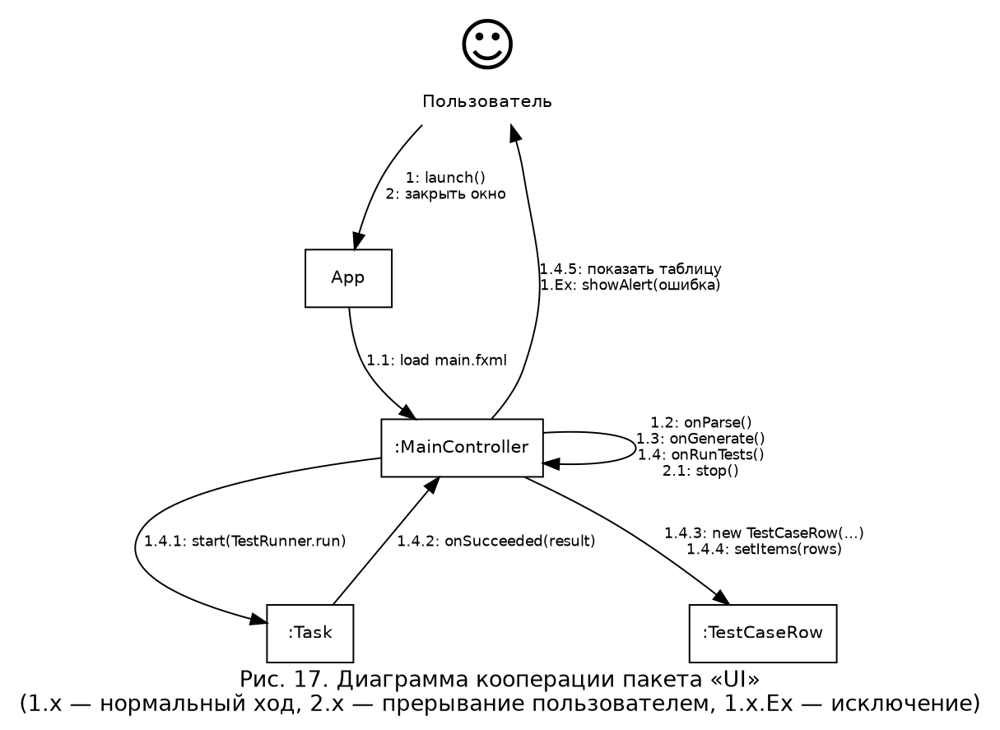

##### Уточнённая диаграмма классов
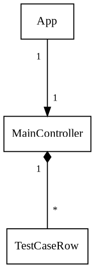

##### Детальная диаграмма классов
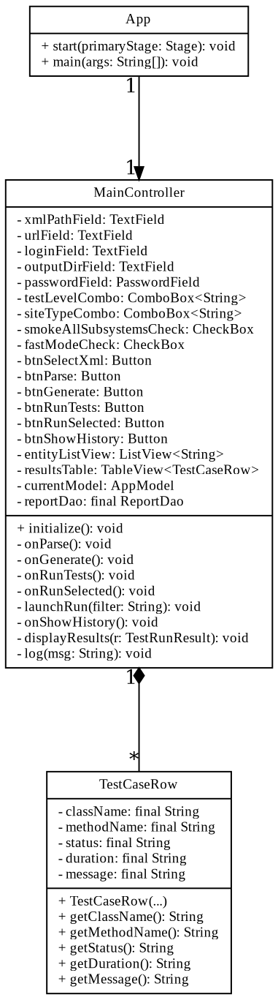

**Таблица. Описание полей класса «MainController»**

| Название                   | Тип                              | Описание                                                                       |
| -------------------------- | -------------------------------- | ------------------------------------------------------------------------------ |
| `xmlPathField`             | `TextField`                      | Поле ввода пути к XML-файлу метаданных.                                        |
| `urlField`                 | `TextField`                      | Поле ввода URL тестируемого веб-приложения.                                    |
| `loginField`               | `TextField`                      | Поле ввода логина пользователя.                                                |
| `passwordField`            | `PasswordField`                  | Поле ввода пароля с маскированием.                                             |
| `outputDirField`           | `TextField`                      | Поле ввода каталога для сгенерированного проекта.                              |
| `testLevelCombo`           | `ComboBox<String>`               | Выпадающий список уровня тестов (SMOKE / BASIC / FULL).                        |
| `smokeAllSubsystemsCheck`  | `CheckBox`                       | Флаг прогона smoke-тестов по всем подсистемам.                                 |
| `fastModeCheck`            | `CheckBox`                       | Флаг быстрого режима (3× headless-Chrome).                                     |
| `siteTypeCombo`            | `ComboBox<String>`               | Выпадающий список типа сайта (E3Core / generic / custom).                      |
| `subsystemField`           | `TextField`                      | Поле ввода названия подсистемы.                                                |
| `btnSelectXml`             | `Button`                         | Кнопка открытия диалога выбора XML.                                            |
| `btnSelectOutputDir`       | `Button`                         | Кнопка открытия диалога выбора каталога.                                       |
| `btnParse`                 | `Button`                         | Кнопка запуска парсинга XML.                                                   |
| `btnGenerate`              | `Button`                         | Кнопка запуска генерации тестов.                                               |
| `btnRunTests`              | `Button`                         | Кнопка запуска всех тестов.                                                    |
| `btnRunSelected`           | `Button`                         | Кнопка открытия диалога выбора тестов.                                         |
| `btnShowHistory`           | `Button`                         | Кнопка показа истории прогонов.                                                |
| `entityListView`           | `ListView<String>`               | Список сущностей XML-модели (левая панель).                                    |
| `resultsTable`             | `TableView<TestCaseRow>`         | Таблица результатов прогона.                                                   |
| `colClass`,`colMethod`,`colStatus`,`colDuration`,`colMessage` | `TableColumn<TestCaseRow,String>` | Столбцы таблицы результатов. |
| `statusLabel`              | `Label`                          | Метка статуса в верхней части окна.                                            |
| `progressBar`              | `ProgressBar`                    | Индикатор прогресса фоновых задач.                                             |
| `logArea`                  | `TextArea`                       | Журнал событий программы.                                                      |
| `totalLabel`,`passedLabel`,`failedLabel` | `Label`            | Метки счётчиков «Всего», «Успешно», «Ошибки».                                  |
| `TEST_CATEGORIES`          | `static final String[][]`        | Каталог пар (label, Surefire-фильтр) для диалога выбора видов тестов.          |
| `currentModel`             | `AppModel`                       | Загруженная XML-модель. `null`, пока не выполнен `onParse()`.                  |
| `reportDao`                | `final ReportDao`                | DAO для сохранения и загрузки истории прогонов.                                |

**Таблица. Описание полей класса «MainController.TestCaseRow»**

| Название      | Тип            | Описание                                                          |
| ------------- | -------------- | ----------------------------------------------------------------- |
| `className`   | `final String` | Имя тестового класса (например, `GskOgskTest`).                   |
| `methodName`  | `final String` | Имя тест-метода (например, `testCreate`).                         |
| `status`      | `final String` | Статус: `OK`, `FAIL` или `SKIP`.                                  |
| `duration`    | `final String` | Длительность выполнения с суффиксом «мс».                          |
| `message`     | `final String` | Текст ошибки или подтверждение успеха.                             |

**Таблица. Описание методов класса «App»**

| Название | Параметры                | Возвращаемое значение | Описание                                                                                                                |
| -------- | ------------------------ | --------------------- | ----------------------------------------------------------------------------------------------------------------------- |
| `start`  | `primaryStage: Stage`    | `void`                | Переопределённый метод `Application`. Загружает FXML, создаёт сцену 1000×700, показывает окно.                          |
| `main`   | `args: String[]`         | `void`                | Static. Точка входа в программу. Вызывает `launch(args)` — запуск JavaFX-runtime.                                       |

**Таблица. Описание методов класса «MainController»**

| Название              | Параметры                                                     | Возвращаемое значение | Описание                                                                                                              |
| --------------------- | ------------------------------------------------------------- | --------------------- | --------------------------------------------------------------------------------------------------------------------- |
| `initialize`          | —                                                             | `void`                | Автовызов после inject FXML. Настраивает CellValueFactory, ComboBox-ы, дефолтные значения полей.                       |
| `onSelectXml`         | —                                                             | `void`                | Открывает `FileChooser` (`*.xml`). Путь — в `xmlPathField`.                                                            |
| `onSelectOutputDir`   | —                                                             | `void`                | Открывает `DirectoryChooser`. Путь — в `outputDirField`.                                                              |
| `onParse`             | —                                                             | `void`                | Создаёт `XmlModelParser`, парсит файл, заполняет `entityListView`, активирует `btnGenerate`.                          |
| `onGenerate`          | —                                                             | `void`                | Создаёт `TestConfig` + `TestGenerator`, запускает `generate(model)`. Активирует кнопки запуска.                       |
| `onRunTests`          | —                                                             | `void`                | Вызывает `launchRun(null)` — прогон всех тестов.                                                                       |
| `onRunSelected`       | —                                                             | `void`                | Открывает диалог выбора с чекбоксами сущностей и видов тестов; собирает Surefire-фильтр; вызывает `launchRun(filter)`. |
| `buildTestFilter`     | `entityChecks: List<CheckBox>`, `typeChecks: List<CheckBox>`  | `String`              | Static. Из чекбоксов строит фильтр `Class1Test,Class2Test#m1+m2`.                                                       |
| `launchRun`           | `testFilter: String`                                          | `void`                | Запускает `Task<TestRunResult>` с `TestRunner`. По завершении — `displayResults` + `reportDao.saveRun`.               |
| `onShowHistory`       | —                                                             | `void`                | `reportDao.getAllRuns()` → сводка в `logArea`, последний прогон — в `resultsTable`.                                  |
| `displayResults`      | `result: TestRunResult`                                       | `void`                | Заполняет `resultsTable` строками `TestCaseRow`, раскрашивает статусы.                                                |
| `getXmlFileName`      | —                                                             | `String`              | Имя файла из `xmlPathField` (`File.getName()`) либо `"unknown.xml"`.                                                  |
| `log`                 | `message: String`                                             | `void`                | Дозапись в `logArea` через `Platform.runLater`.                                                                       |
| `showAlert`           | `title: String`, `content: String`                            | `void`                | Модальный `Alert.ERROR` через `Platform.runLater`.                                                                    |

**Таблица. Описание методов класса «MainController.TestCaseRow»**

| Название         | Параметры                                                                          | Возвращаемое значение | Описание                                                |
| ---------------- | ---------------------------------------------------------------------------------- | --------------------- | ------------------------------------------------------- |
| `TestCaseRow`    | `className, methodName, status, duration, message: String`                          | конструктор           | Инициализирует все пять `final` полей.                   |
| `getClassName`   | —                                                                                  | `String`              | Возвращает имя тест-класса (для PropertyValueFactory).  |
| `getMethodName`  | —                                                                                  | `String`              | Возвращает имя тест-метода.                             |
| `getStatus`      | —                                                                                  | `String`              | Возвращает статус.                                       |
| `getDuration`    | —                                                                                  | `String`              | Возвращает длительность.                                 |
| `getMessage`     | —                                                                                  | `String`              | Возвращает сообщение.                                   |

---

#### 1.5.2.2. Пакет «Parser»

##### Исходная диаграмма классов
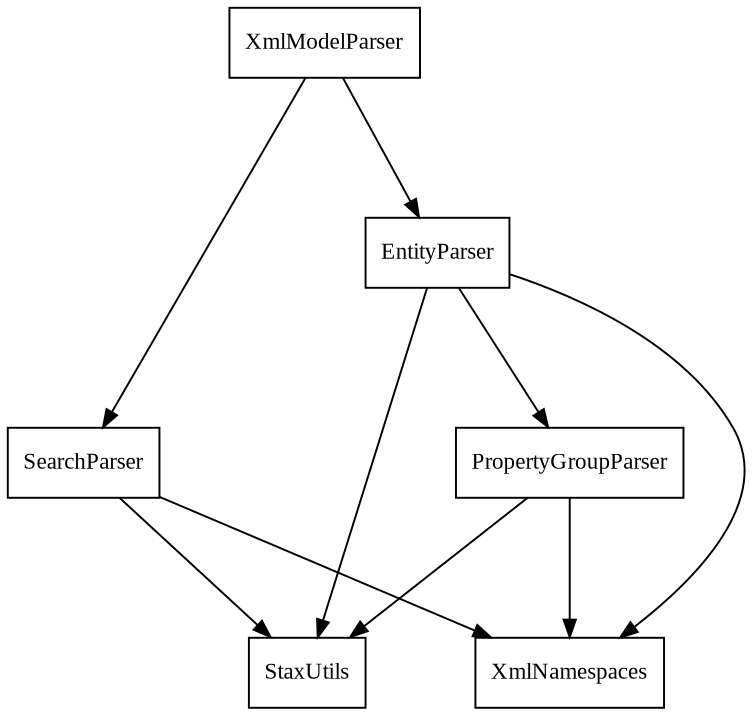

**Таблица. Описание классов пакета «Parser»**

| Класс                  | Описание                                                                                                                                                        |
| ---------------------- | --------------------------------------------------------------------------------------------------------------------------------------------------------------- |
| `XmlModelParser`       | Фасад/координатор парсинга. Открывает StAX-reader, диспетчеризует top-level элементы `<Category>`, `<Object>`, `<Searches>` по специализированным парсерам.     |
| `EntityParser`         | Парсит `<Object>` → `EntityObject` и `<AssociationObjectA>` → `Association`. Делегирует `<Properties>` в `PropertyGroupParser`.                                  |
| `PropertyGroupParser`  | Парсит `<Properties>` → `PropertyGroup`, включая `<Property>` → `Property` и `<Operation>` → `Operation` + `OperationParam` + `Modifier`.                       |
| `SearchParser`         | Парсит `<Searches>` → список `Search` со всеми `<SearchParam>`, `<SearchResult>`, `<SearchResultProperty>`.                                                     |
| `StaxUtils`            | Статические утилиты для StAX: `attr(reader,name)`, `parseInt(value)`, `skipToEnd(reader)`.                                                                       |
| `XmlNamespaces`        | Константы namespace-URI: `NS_E`, `NS_E3`, `NS_MD`. Единый источник правды для проверки `<имя>` в нужном NS.                                                       |

##### Диаграммы последовательностей

**Нормальный ход событий:**
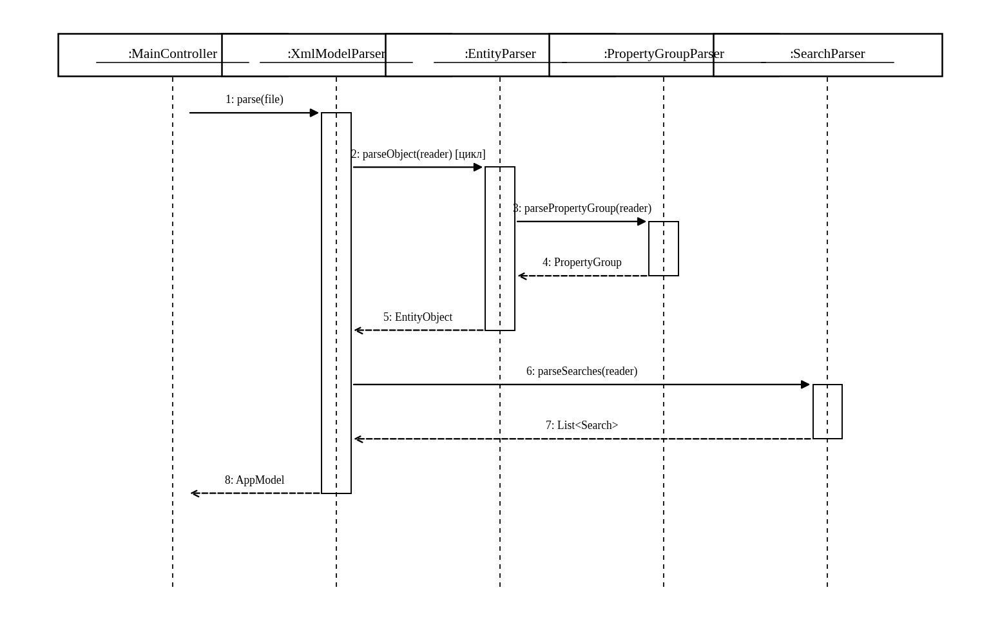

**Прерывание пользователем:**
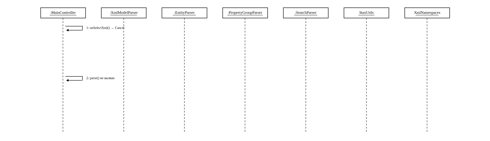

**Прерывание системой:**
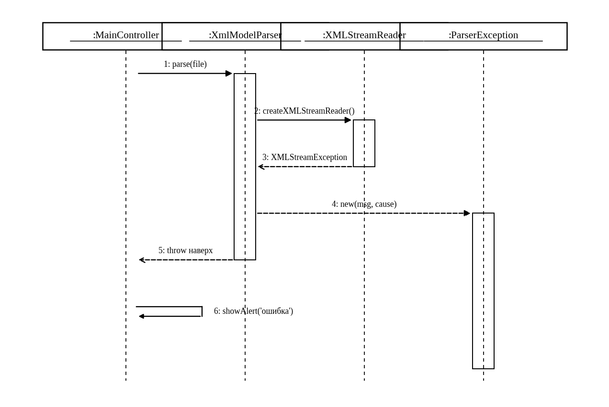

##### Диаграмма кооперации
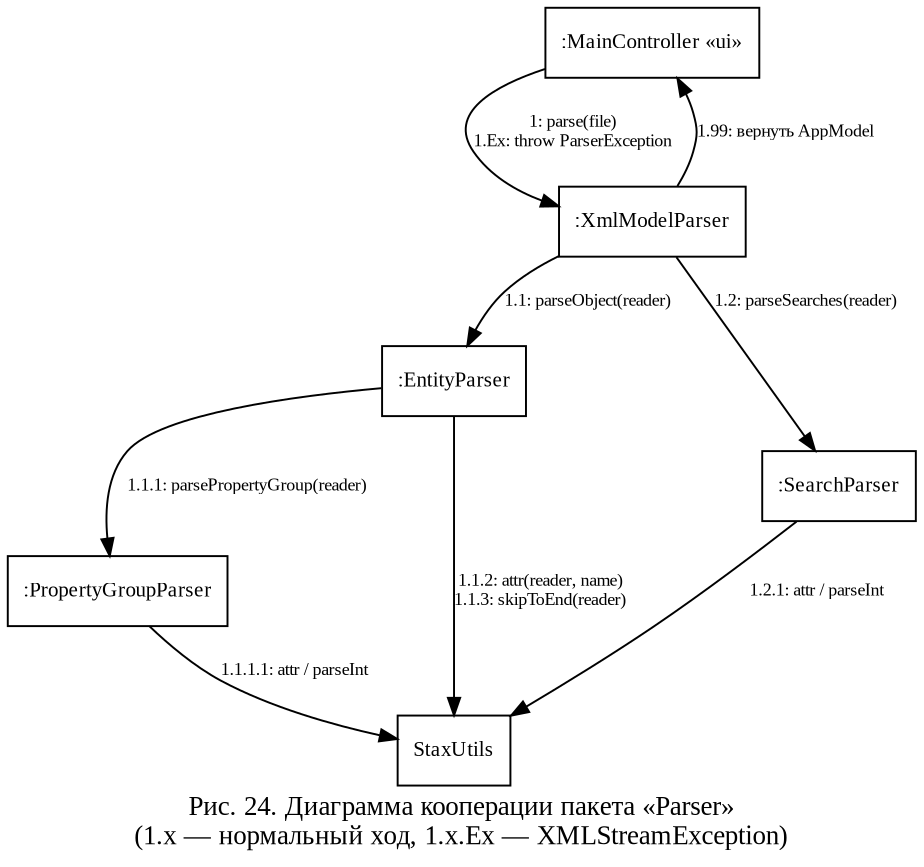

##### Уточнённая диаграмма классов
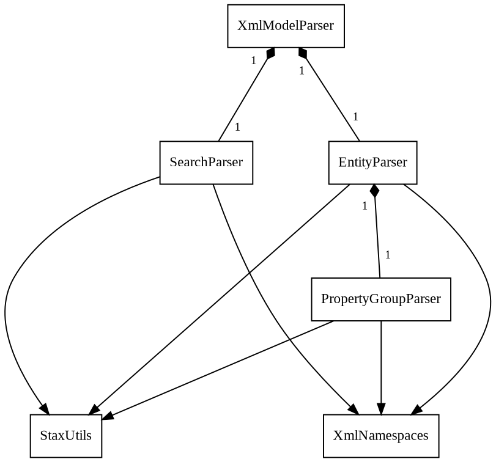

##### Детальная диаграмма классов
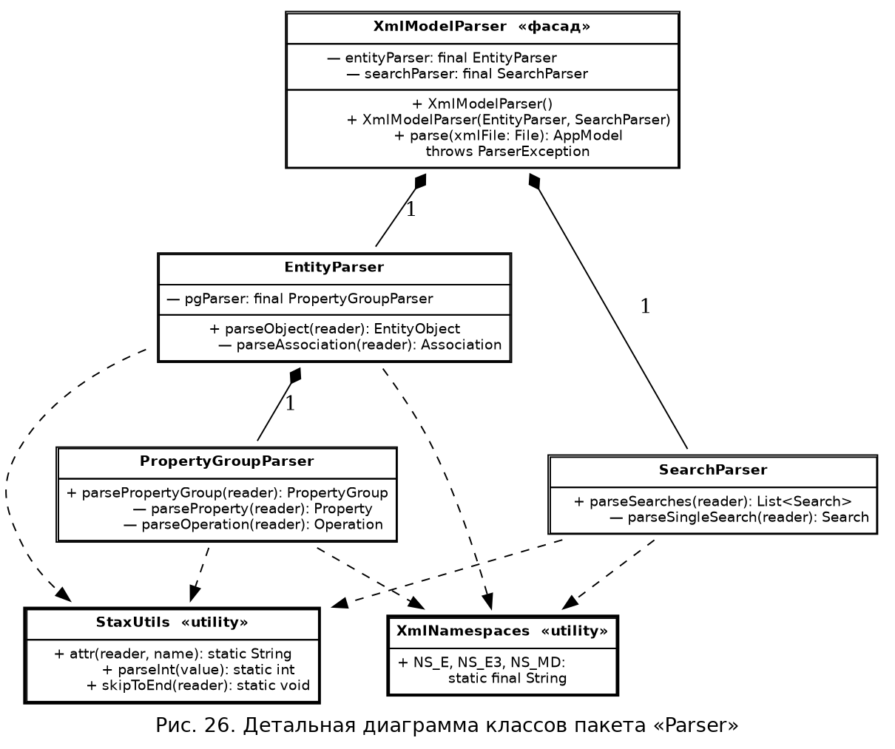

**Таблица. Описание полей классов пакета «Parser»**

| Класс / поле                       | Тип                       | Описание                                                    |
| ---------------------------------- | ------------------------- | ----------------------------------------------------------- |
| `XmlModelParser.entityParser`      | `final EntityParser`      | Делегат для `<Object>` (агрегация — конструктор может принять извне).         |
| `XmlModelParser.searchParser`      | `final SearchParser`      | Делегат для `<Searches>`.                                   |
| `EntityParser.pgParser`            | `final PropertyGroupParser` | Делегат для `<Properties>`.                                |
| `XmlNamespaces.NS_E`               | `static final String`     | `"uuid:EDDBACC6-A83C-4937-9748-B7333C7C9272"`               |
| `XmlNamespaces.NS_E3`              | `static final String`     | `"uuid:EF6807BA-EBA2-42E5-9234-A24542B8791C"`               |
| `XmlNamespaces.NS_MD`              | `static final String`     | `"urn:ruitsol-ru:E3"`                                       |

**Таблица. Описание методов класса «XmlModelParser»**

| Название         | Параметры                                       | Возвращаемое значение | Описание                                                                                    |
| ---------------- | ----------------------------------------------- | --------------------- | ------------------------------------------------------------------------------------------- |
| `XmlModelParser` | —                                               | конструктор           | Создаёт стандартные `EntityParser` и `SearchParser` (композиция).                           |
| `XmlModelParser` | `EntityParser, SearchParser`                    | конструктор           | DI-конструктор для подмены парсеров в тестах.                                               |
| `parse`          | `xmlFile: File`                                 | `AppModel` throws `ParserException` | Открывает StAX-reader, диспетчеризует элементы; оборачивает технические исключения.        |

**Таблица. Описание методов класса «EntityParser»**

| Название           | Параметры                              | Возвращаемое значение | Описание                                                                                        |
| ------------------ | -------------------------------------- | --------------------- | ----------------------------------------------------------------------------------------------- |
| `EntityParser`     | —                                      | конструктор           | Создаёт `PropertyGroupParser` сам (композиция).                                                  |
| `EntityParser`     | `PropertyGroupParser`                  | конструктор           | DI-конструктор.                                                                                  |
| `parseObject`     | `reader: XMLStreamReader`              | `EntityObject` throws `XMLStreamException` | Читает `<Object>` до конца; делегирует `<Properties>` → `pgParser`; вызывает `parseAssociation`. |
| `parseAssociation` | `reader: XMLStreamReader`              | `private Association` throws `XMLStreamException` | Собирает `Association` с под-элементами `<Qualifier>` и `<AssociateItem>`.                       |

**Таблица. Описание методов класса «PropertyGroupParser»**

| Название              | Параметры                  | Возвращаемое значение | Описание                                                                                  |
| --------------------- | -------------------------- | --------------------- | ----------------------------------------------------------------------------------------- |
| `parsePropertyGroup`  | `reader: XMLStreamReader`  | `PropertyGroup` throws `XMLStreamException` | Читает `<Properties>`, делегирует вложенные `<Property>` и `<Operation>`.                  |
| `parseProperty`       | `reader: XMLStreamReader`  | `private Property` throws `XMLStreamException` | Собирает `Property` из атрибутов; `skipToEnd` уводит курсор на закрывающий тег.            |
| `parseOperation`      | `reader: XMLStreamReader`  | `private Operation` throws `XMLStreamException` | Собирает `Operation` + вложенные `<OperationParam>` и `<Modifier>`.                        |

**Таблица. Описание методов класса «SearchParser»**

| Название              | Параметры                  | Возвращаемое значение | Описание                                                                                  |
| --------------------- | -------------------------- | --------------------- | ----------------------------------------------------------------------------------------- |
| `parseSearches`       | `reader: XMLStreamReader`  | `List<Search>` throws `XMLStreamException` | Перебирает все `<Search>` под `<Searches>` и возвращает список.                            |
| `parseSingleSearch`   | `reader: XMLStreamReader`  | `private Search` throws `XMLStreamException` | Собирает `Search` + `<SearchParam>` + `<SearchResult>` + `<SearchResultProperty>`.        |

**Таблица. Описание методов класса «StaxUtils»**

| Название      | Параметры                                       | Возвращаемое значение | Описание                                                                              |
| ------------- | ----------------------------------------------- | --------------------- | ------------------------------------------------------------------------------------- |
| `attr`        | `reader: XMLStreamReader, name: String`         | `static String`       | Безопасно читает атрибут, при отсутствии возвращает `""`.                              |
| `parseInt`    | `value: String`                                 | `static int`          | Безопасный парсинг int, при пустоте/ошибке — `0`.                                     |
| `skipToEnd`   | `reader: XMLStreamReader`                       | `static void` throws `XMLStreamException` | Прокручивает курсор до закрытия текущего элемента (счётчик depth).      |

---

#### 1.5.2.3. Пакет «Model»

##### Исходная диаграмма классов
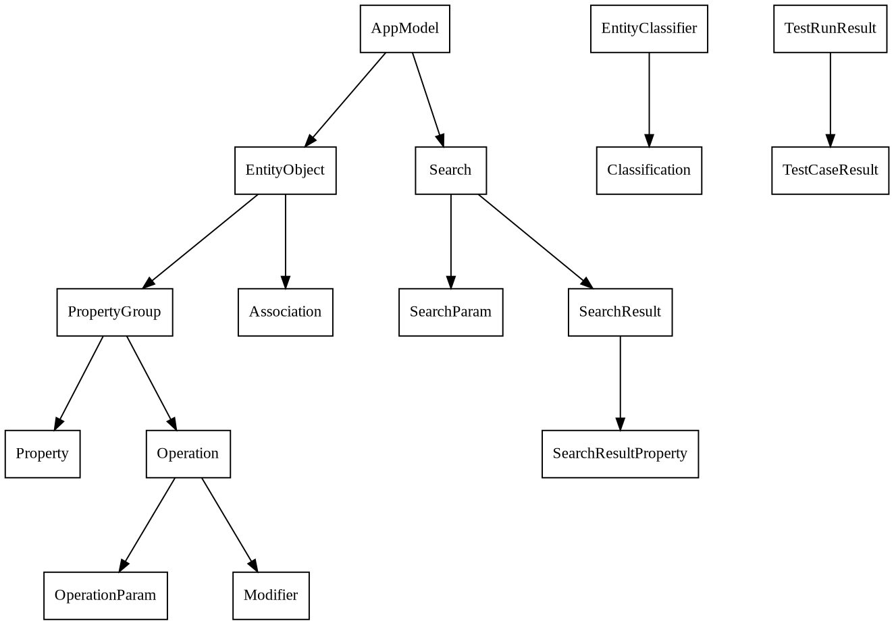

**Таблица. Описание классов пакета «Model»**

| Класс / enum                              | Описание                                                                                                              |
| ----------------------------------------- | --------------------------------------------------------------------------------------------------------------------- |
| `AppModel`                                | Корень объектной модели метаданных. Список сущностей и поисков, имя категории, GUID.                                  |
| `EntityObject`                            | Бизнес-сущность (карточка): имя, ключевые атрибуты, ассоциации, группы свойств.                                       |
| `PropertyGroup`                           | Группа свойств сущности: вкладка карточки (`typeLink="P"`) или Grid внутри неё (`stereoType="Grid"`).                  |
| `Property`                                | Одно поле формы: атрибут БД + UI-метаданные (тип, маска, обязательность, порядок).                                    |
| `Operation`                               | Серверная операция на форме: метод, модуль, параметры, модификаторы.                                                  |
| `OperationParam`                          | Параметр серверной операции (имя, тип параметра, тип значения).                                                       |
| `Modifier`                                | Кнопка-модификатор на форме (например, «Создать», «Удалить»).                                                          |
| `ModifyType`  *(enum)*                    | Код типа модификации: `I` (Insert), `U` (Update), `D` (Delete), `E` (LogicalEdit), `A` (Archive).                     |
| `Association`                             | Связь сущности с другой: FK-пикер или дочерняя коллекция, через `associateItemGuid`.                                  |
| `Search`                                  | Параметрический поиск: имя, запрос, параметры, описание результата-грида.                                             |
| `SearchParam`                             | Параметр формы поиска: имя, заголовок, тип, маска, обязательность.                                                    |
| `SearchResult`                            | Описание грида-результата поиска: имя ID-объекта + колонки.                                                            |
| `SearchResultProperty`                    | Колонка в гриде результата поиска.                                                                                    |
| `AttrType`   *(enum)*                     | Тип атрибута: `STRING`, `DECIMAL`, `DATE`, `DATETIME`.                                                                |
| `EntityKind` *(enum)*                     | Логическая роль сущности: `PRIMARY`, `CHILD`, `REFERENCE_DICTIONARY`.                                                  |
| `EntityClassifier`                        | Static-классификатор: определяет роль сущности (используется генератором для решения, нужно ли генерировать тест).     |
| `EntityClassifier.Classification`         | Результат классификации: `kind`, `reason`, опционально родительская сущность и Grid.                                  |
| `TestRunResult`                           | Результат запуска тестов: счётчики + список `TestCaseResult` + maven-stdout.                                          |
| `TestCaseResult`                          | Результат одного тест-метода: статус, длительность, скриншоты, шаги, поисковые параметры.                              |
| `TestCaseResult.StepTiming`               | Один шаг теста: имя + длительность.                                                                                   |

##### Диаграммы последовательностей

**Нормальный ход событий:**
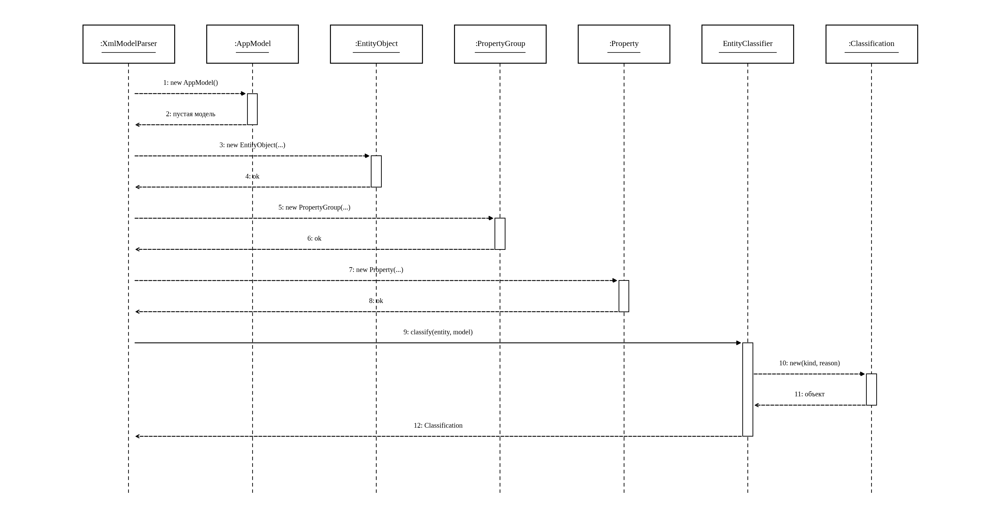

**Прерывание пользователем:**
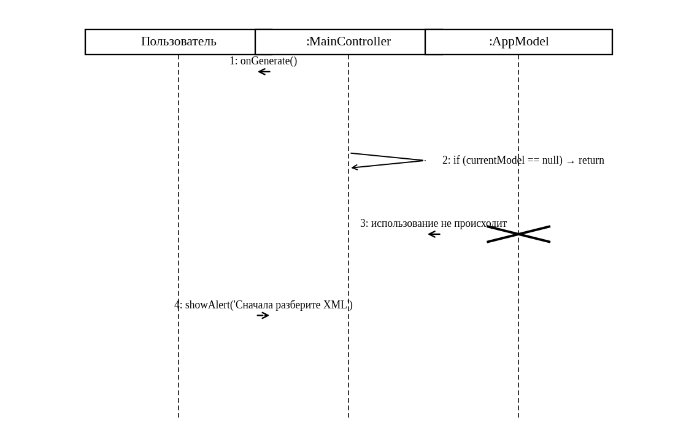

**Прерывание системой:**
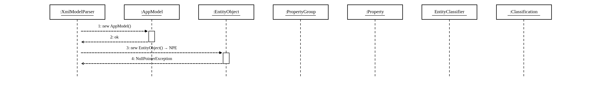

##### Диаграмма кооперации
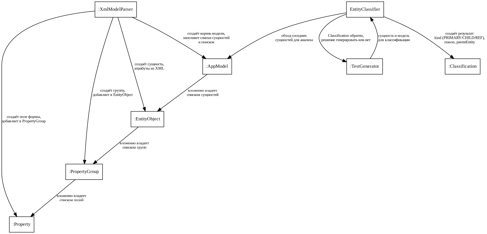

##### Уточнённая диаграмма классов
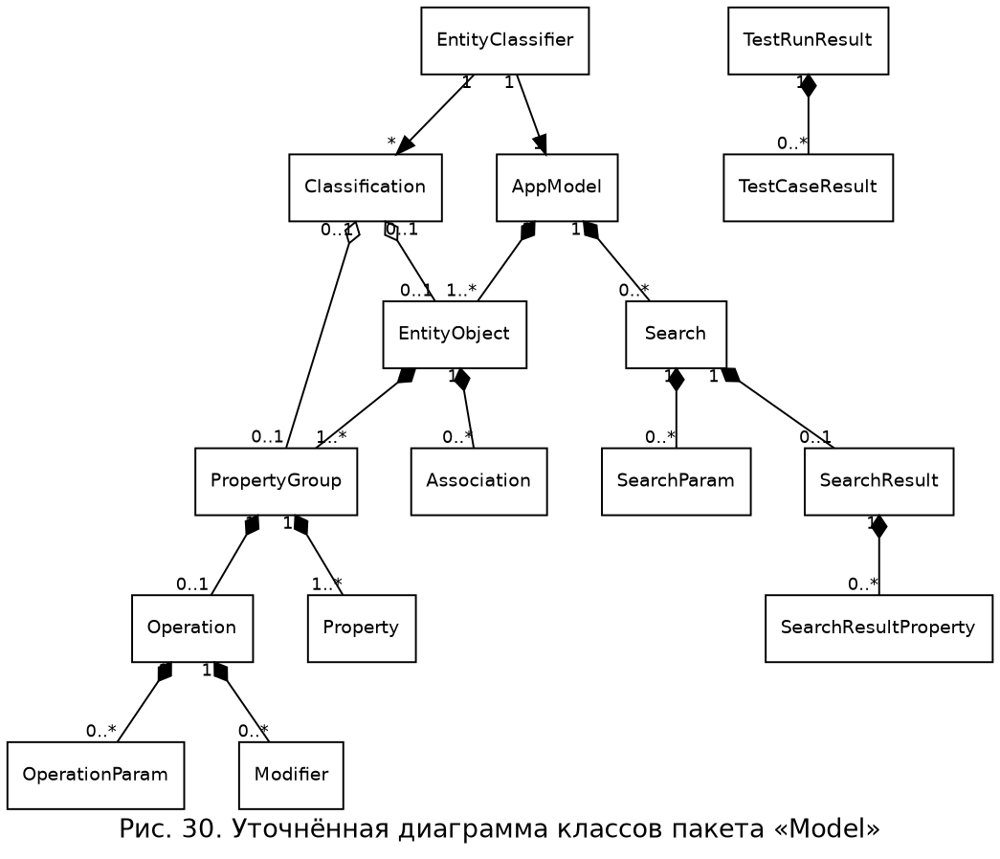

##### Детальная диаграмма классов
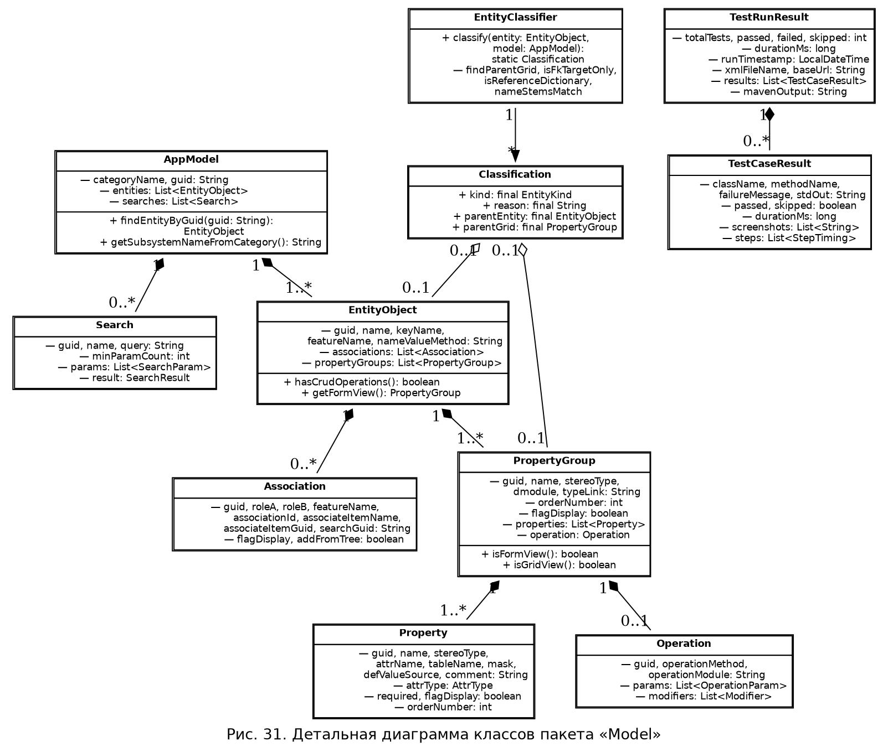

**Таблица. Описание полей класса «AppModel»**

| Название       | Тип                       | Описание                                                       |
| -------------- | ------------------------- | -------------------------------------------------------------- |
| `categoryName` | `String`                  | Полное имя категории из XML (`"Logical View::ГСК"`).            |
| `guid`         | `String`                  | GUID корневой категории.                                       |
| `entities`     | `List<EntityObject>`      | Все сущности модели.                                            |
| `searches`     | `List<Search>`            | Все параметрические поиски модели.                              |

**Таблица. Описание полей класса «EntityObject»**

| Название           | Тип                  | Описание                                                        |
| ------------------ | -------------------- | --------------------------------------------------------------- |
| `guid`             | `String`             | GUID сущности.                                                  |
| `name`             | `String`             | Человекочитаемое имя (например, «ГСК/ОГСК»).                    |
| `keyName`          | `String`             | Имя ключевого поля для отображения сущности.                    |
| `featureName`      | `String`             | Технический префикс (например, `V_S_GB_SOCIETY`).               |
| `nameValueMethod`  | `String`             | Имя метода вычисления визуального имени.                        |
| `associations`     | `List<Association>`  | Связи с другими сущностями.                                     |
| `propertyGroups`   | `List<PropertyGroup>`| Группы свойств (вкладки формы + Grid-ы).                        |

**Таблица. Описание полей класса «PropertyGroup»**

| Название       | Тип                | Описание                                                                |
| -------------- | ------------------ | ----------------------------------------------------------------------- |
| `guid`         | `String`           | GUID группы.                                                            |
| `name`         | `String`           | Имя группы (для grid это имя дочерней коллекции).                       |
| `stereoType`   | `String`           | Стереотип группы (`"Form"`, `"Grid"`).                                  |
| `dmodule`      | `String`           | Имя модуля БД.                                                          |
| `typeLink`     | `String`           | Тип связи: `"P"` — основная форма, иное — вспомогательная.              |
| `orderNumber`  | `int`              | Порядок отображения.                                                    |
| `flagDisplay`  | `boolean`          | Видимость группы в UI.                                                  |
| `properties`   | `List<Property>`   | Поля группы.                                                            |
| `operation`    | `Operation`        | Серверная операция (может быть `null`).                                  |

**Таблица. Описание полей класса «Property»**

| Название            | Тип        | Описание                                                       |
| ------------------- | ---------- | -------------------------------------------------------------- |
| `guid`              | `String`   | GUID поля.                                                     |
| `name`              | `String`   | Человекочитаемое имя поля (видно на форме).                    |
| `stereoType`        | `String`   | Стереотип (`"Mask"`, `"Lookup"` и т.д.).                       |
| `dmodule`           | `String`   | Имя БД-модуля.                                                 |
| `attrName`          | `String`   | Имя атрибута БД (например, `KEY_GB_SOCIETY`).                  |
| `tableName`         | `String`   | Имя таблицы БД.                                                |
| `attrType`          | `AttrType` | Тип значения: `STRING` / `DECIMAL` / `DATE` / `DATETIME`.      |
| `required`          | `boolean`  | Обязательное поле (`necessarily=1` в XML).                     |
| `mask`              | `String`   | Маска ввода (если есть).                                       |
| `orderNumber`       | `int`      | Порядок отображения на форме.                                  |
| `flagDisplay`       | `boolean`  | Видимость поля в UI.                                           |
| `defValueSource`    | `String`   | Источник значения по умолчанию.                                |
| `comment`           | `String`   | Комментарий проектировщика.                                    |

**Таблица. Описание методов класса «AppModel»**

| Название                          | Параметры              | Возвращаемое значение | Описание                                                                          |
| --------------------------------- | ---------------------- | --------------------- | --------------------------------------------------------------------------------- |
| `getCategoryName` / `setCategoryName` | (`String`)         | `String` / `void`     | Геттер/сеттер поля `categoryName`.                                                |
| `getGuid` / `setGuid`             | (`String`)             | `String` / `void`     | Геттер/сеттер GUID корневой категории.                                            |
| `getEntities` / `setEntities`     | (`List<EntityObject>`) | `List<…>` / `void`    | Геттер/сеттер списка сущностей.                                                   |
| `getSearches` / `setSearches`     | (`List<Search>`)       | `List<…>` / `void`    | Геттер/сеттер списка поисков.                                                     |
| `findEntityByGuid`                | `guid: String`         | `EntityObject`        | Линейный поиск сущности по GUID, `null` если нет.                                  |
| `getSubsystemNameFromCategory`    | —                      | `String`              | Из `categoryName` вида `"Logical View::ГСК"` возвращает `"ГСК"`.                  |

**Таблица. Описание методов класса «EntityObject»**

| Название                  | Параметры              | Возвращаемое значение | Описание                                                                       |
| ------------------------- | ---------------------- | --------------------- | ------------------------------------------------------------------------------ |
| Геттеры/сеттеры 7 полей  | (`String/List<…>`)     | соответствующее       | Стандартные accessors.                                                          |
| `hasCrudOperations`       | —                      | `boolean`             | `true`, если хотя бы один PropertyGroup имеет непустые модификаторы операции.   |
| `getFormView`             | —                      | `PropertyGroup`       | Первый PropertyGroup с `isFormView()` (`typeLink="P"`); `null` если нет.        |

**Таблица. Описание методов класса «PropertyGroup»**

| Название           | Параметры        | Возвращаемое значение | Описание                                                |
| ------------------ | ---------------- | --------------------- | ------------------------------------------------------- |
| Геттеры/сеттеры 9 полей | —          | соответствующее        | Стандартные accessors.                                  |
| `isFormView`       | —                | `boolean`             | `"P".equals(typeLink)` — это основная форма карточки.   |
| `isGridView`       | —                | `boolean`             | `"Grid".equals(stereoType)` — это табличная вкладка.     |

**Таблица. Описание методов класса «EntityClassifier»**

| Название                | Параметры                              | Возвращаемое значение | Описание                                                                            |
| ----------------------- | -------------------------------------- | --------------------- | ----------------------------------------------------------------------------------- |
| `classify`              | `entity: EntityObject`, `model: AppModel` | `static Classification` | Цепочка правил: CHILD → REFERENCE_DICTIONARY → FK-target → PRIMARY (по умолчанию). |
| `findParentGrid`        | `entity`, `model`                      | `private Classification` | Ищет родительский PropertyGroup со `stereoType="Grid"`, чьё имя совпадает по корням слов. |
| `isFkTargetOnly`        | `entity`, `model`                      | `private String`      | Сущность считается FK-целью, если на неё ссылаются только как пикер.                |
| `isChildOf`             | `child`, `parent`                      | `private boolean`     | `true`, если `child` появляется как Grid-вкладка внутри `parent`.                   |
| `isReferenceDictionary` | `entity`, `model`                      | `private String`      | `V_S_…` префикс или пустые параметры всех поисков → справочник.                     |
| `isTrivialResult`       | `search: Search`                       | `private boolean`     | `true`, если результат содержит только `SearchKey`+`SearchName`.                     |
| `nameStemsMatch`        | `a, b: String`                         | `private boolean`     | Имена считаются совпадающими, если первые ≥3 буквы каждого слова совпадают.         |

---

#### 1.5.2.4. Пакет «Generator»

##### Исходная диаграмма классов
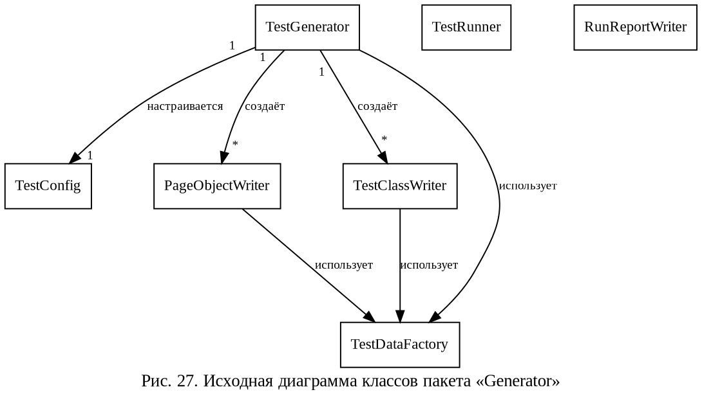

**Таблица. Описание классов пакета «Generator»**

| Класс                | Описание                                                                                                                                                              |
| -------------------- | --------------------------------------------------------------------------------------------------------------------------------------------------------------------- |
| `TestConfig`         | Контейнер настроек генерации: `baseUrl`, `login`, `password`, `outputDir`, `browserType`, `siteType`, `subsystemName`, `testLevel`, `smokeAllSubsystems`.            |
| `TestGenerator`      | Дирижёр генерации: создаёт `pom.xml`, `BaseTest`, `SharedDriver`, smoke-тесты и для каждой PRIMARY-сущности — Page Object и Test-класс через writer-ы.                |
| `PageObjectWriter`   | Генерирует Page Object Java-класс (`XxxPage`) по `EntityObject` + `TestConfig`. Скрывает работу с ExtJS-формами.                                                       |
| `TestClassWriter`    | Генерирует JUnit-5 тест-класс (`XxxTest`) с методами `testCreate`, `testCreateOnlyRequired`, `testUpdate`, `testDelete`, `testSearch*`, `testGrid*` и др.              |
| `TestDataFactory`    | Static-фабрика тестовых значений по `AttrType` и `mask`: случайные строки, decimal-числа, даты в формате `dd.MM.yyyy`.                                                |
| `TestRunner`         | Запускает `mvn test` в сгенерированном проекте через `ProcessBuilder`, читает stdout построчно и парсит `target/surefire-reports/*.xml` → `TestRunResult`.            |
| `RunReportWriter`    | Генерирует пользовательский HTML-отчёт v5 с фотолетописью и CSV-выгрузку из `TestRunResult`.                                                                          |

##### Диаграммы последовательностей

**Нормальный ход событий:**
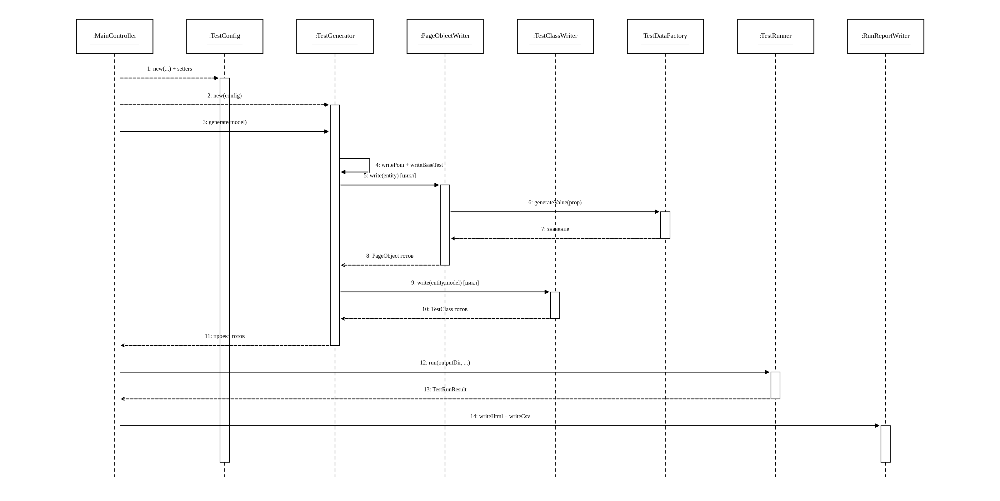

**Прерывание пользователем:**
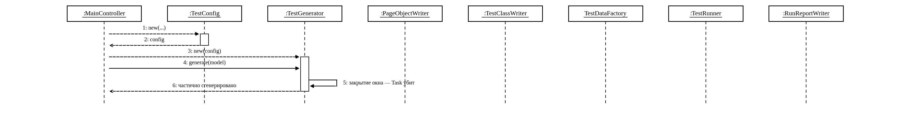

**Прерывание системой:**
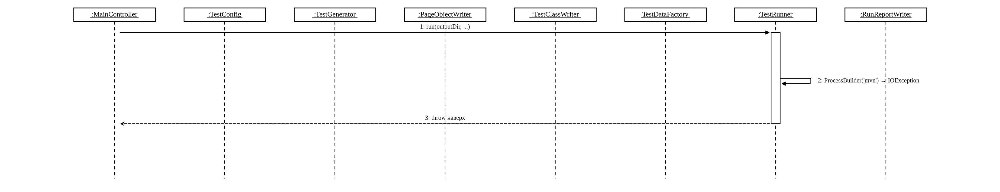

##### Диаграмма кооперации
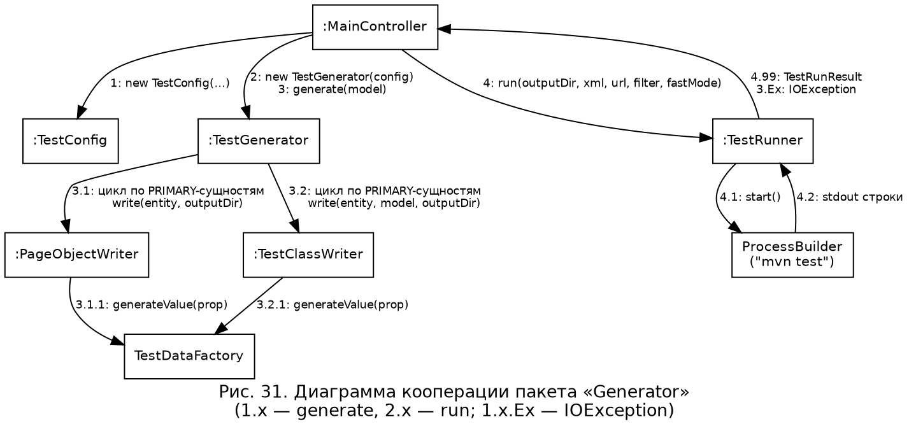

##### Уточнённая диаграмма классов
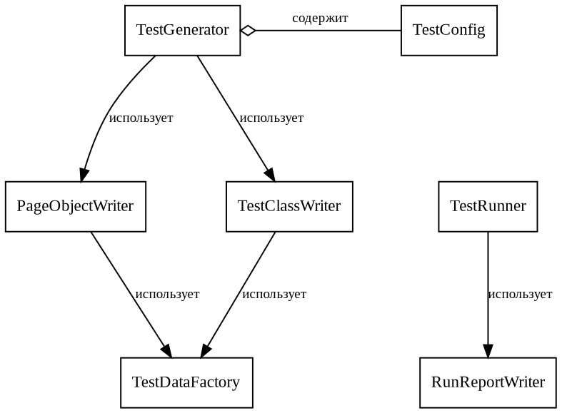

##### Детальная диаграмма классов
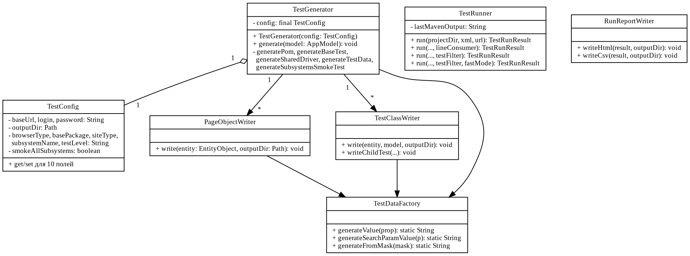

**Таблица. Описание полей класса «TestConfig»**

| Название              | Тип       | Описание                                                                   |
| --------------------- | --------- | -------------------------------------------------------------------------- |
| `baseUrl`             | `String`  | URL тестируемого сайта.                                                    |
| `login`               | `String`  | Имя пользователя.                                                          |
| `password`            | `String`  | Пароль пользователя.                                                       |
| `outputDir`           | `Path`    | Каталог для записи сгенерированного Maven-проекта.                         |
| `browserType`         | `String`  | Имя браузера (`"chrome"` или `"firefox"`).                                 |
| `basePackage`         | `String`  | Базовый Java-пакет для сгенерированного кода (`"generated"`).               |
| `siteType`            | `String`  | Тип сайта: `"e3core"`, `"generic"`, `"custom"`.                             |
| `subsystemName`       | `String`  | Имя подсистемы внутри E3Core, в которую заходим после логина.              |
| `testLevel`           | `String`  | Уровень: `"smoke"`, `"basic"`, `"full"`.                                    |
| `smokeAllSubsystems`  | `boolean` | Прогонять ли smoke по всем подсистемам.                                    |

**Таблица. Описание полей классов «TestGenerator» и «TestRunner»**

| Класс / поле                  | Тип                  | Описание                                                |
| ----------------------------- | -------------------- | ------------------------------------------------------- |
| `TestGenerator.config`        | `final TestConfig`   | Настройки генерации (внедряются через конструктор).     |
| `TestRunner.lastMavenOutput`  | `String`             | Кэш последнего stdout `mvn test` для повторного чтения. |

**Таблица. Описание методов класса «TestConfig»**

| Название                | Параметры | Возвращаемое значение | Описание                                                       |
| ----------------------- | --------- | --------------------- | -------------------------------------------------------------- |
| Геттеры/сеттеры 10 полей | (по типу поля) | соответствующее   | Стандартные accessors. Логики нет — POJO-контейнер настроек.    |

**Таблица. Описание методов класса «TestGenerator»**

| Название                       | Параметры                                  | Возвращаемое значение | Описание                                                                                                 |
| ------------------------------ | ------------------------------------------ | --------------------- | -------------------------------------------------------------------------------------------------------- |
| `TestGenerator`                | `config: TestConfig`                       | конструктор           | Сохраняет конфиг как поле (агрегация).                                                                   |
| `generate`                     | `model: AppModel`                          | `void` throws `IOException` | Главная точка: пишет `pom.xml`, `BaseTest`, `SharedDriver`, smoke-тесты, для каждой PRIMARY-сущности — Page Object + Test-класс. |
| `generatePom`                  | `outputDir: Path`                          | `private void` throws `IOException` | Пишет `pom.xml` сгенерированного проекта (Selenium, JUnit5, WebDriverManager, Surefire 3.2.2). |
| `generateBaseTest`             | `srcDir: Path, basePackage: String`        | `private void` throws `IOException` | Пишет `BaseTest.java` с общим `@BeforeAll/@AfterAll` для всех тест-классов.                    |
| `generateSharedDriver`         | `srcDir: Path, basePackage: String`        | `private void` throws `IOException` | Пишет `SharedDriver.java` — singleton для переиспользования Chrome между тестами.                |
| `generateTestData`             | `srcDir: Path, basePackage: String`        | `private void` throws `IOException` | Пишет утилиту `TestData.java` со случайной генерацией строк/чисел.                              |
| `generateJUnitConfig`          | `outputDir: Path`                          | `private void` throws `IOException` | Создаёт `junit-platform.properties` (параллелизм, видимость).                                   |
| `generateSubsystemsSmokeTest`  | `srcDir: Path, basePackage: String`        | `private void` throws `IOException` | Пишет smoke-тест прохода по всем подсистемам (если включено).                                   |

**Таблица. Описание методов класса «PageObjectWriter»**

| Название                       | Параметры                                                              | Возвращаемое значение | Описание                                                                                                |
| ------------------------------ | ---------------------------------------------------------------------- | --------------------- | ------------------------------------------------------------------------------------------------------- |
| `PageObjectWriter`             | `basePackage: String`                                                  | конструктор           | Сохраняет базовый пакет для импортов в сгенерированных классах.                                          |
| `write`                        | `entity: EntityObject, outputDir: Path`                                | `void` throws `IOException` | Генерирует Java-класс `XxxPage` с методами `open()`, `clickCreate()`, `fillField()`, `clickSave()` и т.п. |
| `getFieldValue`                | `driver, fieldName: String`                                            | `String`              | Runtime-метод: читает значение из ExtJS-поля через JS-executor.                                          |
| `checkAllFieldsPresent`        | `driver, fields: List<String>`                                         | `boolean`             | Runtime-метод: проверяет что все указанные поля присутствуют в форме.                                    |
| `fieldHasError`                | `driver, fieldName: String`                                            | `boolean`             | Runtime-метод: проверяет что у поля стоит флаг ошибки валидации.                                          |
| `hasValidationErrors`          | `driver`                                                               | `boolean`             | Runtime-метод: проверяет наличие любых ошибок на форме.                                                  |
| `isFieldDisplayed`             | `driver, fieldName: String`                                            | `boolean`             | Runtime-метод: проверяет видимость поля.                                                                 |
| `getTableRowCount`             | `driver, tableId: String`                                              | `int`                 | Runtime-метод: число строк в указанной ExtJS-таблице.                                                    |
| `clearForm`                    | `driver`                                                               | `void`                | Runtime-метод: очищает все поля формы.                                                                  |
| `fillAllFields`                | `driver, values: Map<String,String>`                                   | `void`                | Runtime-метод: заполняет все поля формы значениями из карты.                                            |
| `fillRequiredFields`           | `driver, values: Map<String,String>`                                   | `void`                | Runtime-метод: заполняет только обязательные поля.                                                       |
| `getDisplayProperties`         | `entity: EntityObject`                                                 | `private List<Property>` | Видимые поля формы (`flagDisplay=true`) основной PropertyGroup.                                         |
| `isSystemField`                | `prop: Property`                                                       | `private boolean`     | Эвристика «системное поле» (исключается из автозаполнения).                                              |
| `dumpDropdownDiagnostic`       | `driver, fieldName: String`                                            | `private void`        | Диагностика — печатает в лог состояние ExtJS-выпадашки при ошибке.                                       |
| `fillFKViaDropdown`            | `driver, fieldName, value: String`                                     | `private void`        | Заполнение FK-поля через ExtJS-комбобокс с поиском по подстроке.                                         |
| `fillPropertyGridField`        | `driver, fieldName, value: String`                                     | `private void`        | Strategy A: `rec.set('value', val)` через ExtJS API + fallback на DOM-editor.                            |
| `writeInputMethod`             | `w, prop: Property`                                                    | `private void`        | Генерирует Java-код метода ввода значения в одно поле.                                                  |
| `writeFilAllRequiredMethod`    | `w, properties: List<Property>`                                        | `private void`        | Генерирует код метода `fillRequiredFields`.                                                              |
| `writeFillAllFieldsMethod`     | `w, properties: List<Property>`                                        | `private void`        | Генерирует код метода `fillAllFields`.                                                                   |
| `writeModifierMethod`          | `w, mod: Modifier`                                                     | `private void`        | Генерирует метод нажатия кнопки-модификатора (Создать, Удалить, …).                                     |
| `writeCheckFieldsPresentMethod`| `w, properties: List<Property>`                                        | `private void`        | Генерирует код метода `checkAllFieldsPresent`.                                                           |

**Таблица. Описание методов класса «TestClassWriter»**

| Название                       | Параметры                                                              | Возвращаемое значение | Описание                                                                                                       |
| ------------------------------ | ---------------------------------------------------------------------- | --------------------- | -------------------------------------------------------------------------------------------------------------- |
| `TestClassWriter`              | `basePackage: String, testLevel: String`                                | конструктор           | Сохраняет базовый пакет и уровень тестов (SMOKE/BASIC/FULL — влияет на набор генерируемых методов).            |
| `write`                        | `entity: EntityObject, model: AppModel, outputDir: Path`                | `void` throws `IOException` | Генерирует тест-класс `XxxTest` с JUnit5-методами по уровню теста.                                            |
| `write`                        | `entity, model, outputDir, disabledReason: String`                      | `void` throws `IOException` | Перегрузка, добавляющая `@Disabled(reason)` ко всем методам класса (для CHILD/DICTIONARY).                    |
| `writeChildTest`               | `entity, model, outputDir, parentEntity, parentGrid`                    | `void` throws `IOException` | Особый случай: тесты для CHILD-сущности живут внутри карточки родителя; навигация через Grid-вкладку.          |
| `isBasicOrFull`                | —                                                                      | `private boolean`     | Уровень тестов BASIC или FULL.                                                                                 |
| `isFull`                       | —                                                                      | `private boolean`     | Уровень тестов FULL.                                                                                            |
| `writeFieldsPresentTest`       | `w, properties, entityName`                                            | `private void`        | Тест `testFieldsPresent` — проверка наличия всех полей формы.                                                  |
| `writeCreateTest`              | `w, displayProperties: List<Property>`                                 | `private void`        | Тест `testCreate` — полное заполнение всех полей и сохранение.                                                  |
| `writeCreateWithOnlyRequiredTest` | `w`                                                                  | `private void`        | Тест `testCreateOnlyRequired` — заполнение только обязательных и сохранение.                                    |
| `writeUpdateTest`              | `w, properties: List<Property>`                                        | `private void`        | Тест `testUpdate` — изменение записи.                                                                          |
| `writeDeleteTest`              | `w`                                                                    | `private void`        | Тест `testDelete` — удаление записи.                                                                            |
| `writeLogicalEditTest`         | `w`                                                                    | `private void`        | Тест `testLogicalEdit` — логическое удаление.                                                                  |
| `writeArchiveTest`             | `w`                                                                    | `private void`        | Тест `testArchive` — архивирование.                                                                            |
| `writeRequiredFieldValidationTest` | `w, requiredProperties: List<Property>`                            | `private void`        | Тест валидации: оставить все обязательные поля пустыми → ошибка.                                                |
| `writePartialValidationTest`   | `w, requiredProperties: List<Property>`                                | `private void`        | Тест валидации: заполнить N-1 обязательных полей → ошибка.                                                      |
| `writeSearchTest`              | `w, search: Search, index: int`                                        | `private void`        | Тест поиска `testSearchN` с правильными параметрами.                                                            |
| `writeSearchEmptyResultTest`   | `w, search: Search, index: int`                                        | `private void`        | Тест поиска с заведомо неподходящими параметрами → пустой результат.                                            |
| `writeGridTest`                | `w, grid: PropertyGroup, entity: EntityObject`                         | `private void`        | Тест отображения Grid-вкладки внутри карточки.                                                                  |
| `writeChildGridColumnsTest`    | `w, gridColumns, tabName`                                              | `private void`        | Тест колонок CHILD-сущности в Grid-вкладке родителя.                                                            |
| `writeChildCreateTest`         | `w, displayProperties, tabName`                                        | `private void`        | Создание дочерней записи через карточку родителя.                                                              |
| `writeChildUpdateTest`         | `w, displayProperties, tabName`                                        | `private void`        | Обновление дочерней записи.                                                                                    |
| `writeChildDeleteTest`         | `w, tabName`                                                           | `private void`        | Удаление дочерней записи.                                                                                      |
| `hasModifier`                  | `operation: Operation, type: ModifyType`                               | `private boolean`     | Проверка: у операции есть модификатор такого типа (I/U/D/E/A).                                                  |
| `getDisplayProperties`         | `entity: EntityObject`                                                 | `private List<Property>` | Видимые поля формы.                                                                                            |
| `isSystemField`                | `prop: Property`                                                       | `private boolean`     | Системное поле — исключается из автозаполнения.                                                                 |
| `isSystemFieldByName`          | `prop: Property`                                                       | `private boolean`     | Системное поле по имени (название содержит «дата создания», «автор» и т.п.).                                    |
| `isFkOnlySearch`               | `s: Search`                                                            | `private boolean`     | Поиск используется ТОЛЬКО как FK-пикер (не нужен отдельный testSearch).                                         |

**Таблица. Описание методов класса «TestDataFactory»**

| Название                       | Параметры                  | Возвращаемое значение | Описание                                                                                  |
| ------------------------------ | -------------------------- | --------------------- | ----------------------------------------------------------------------------------------- |
| `generateValue`                | `property: Property`       | `static String`       | По `AttrType` и `mask` подбирает корректное случайное значение для поля.                  |
| `generateSearchParamValue`     | `param: SearchParam`       | `static String`       | То же для параметров поиска.                                                              |
| `generateFromMask`             | `mask: String`             | `static String`       | Генерирует строку, удовлетворяющую маске ввода ExtJS.                                     |
| `generateValueExpression`      | `property: Property`       | `static String`       | Возвращает Java-выражение, вычисляющее значение в runtime (для запуска тестов в разные моменты времени). |
| `nowMskMinus10`                | —                          | `private static String` | Текущее московское время минус 10 минут (для дат в прошлом).                              |
| `todayMsk`                     | —                          | `private static String` | Сегодняшняя дата в Московском часовом поясе.                                              |
| `looksLikeDateMask`            | `mask: String`             | `private static boolean` | Эвристика «маска похожа на дату».                                                       |
| `looksLikeDateTimeMask`        | `mask: String`             | `private static boolean` | Эвристика «маска похожа на дату+время».                                                 |

**Таблица. Описание методов класса «TestRunner»**

| Название                | Параметры                                                                                  | Возвращаемое значение | Описание                                                                                            |
| ----------------------- | ------------------------------------------------------------------------------------------ | --------------------- | --------------------------------------------------------------------------------------------------- |
| `run`                   | `projectDir: Path, xmlFileName: String, baseUrl: String`                                   | `TestRunResult` throws `IOException` | Запускает `mvn test` без фильтра, последовательно.                                              |
| `run`                   | `projectDir, xmlFileName, baseUrl, lineConsumer: Consumer<String>`                          | `TestRunResult` throws `IOException` | То же + потоковый приёмник stdout-строк (для лога UI).                                            |
| `run`                   | `projectDir, xmlFileName, baseUrl, lineConsumer, testFilter: String`                       | `TestRunResult` throws `IOException` | + Surefire-фильтр `-Dtest=...`.                                                                    |
| `run`                   | `projectDir, xmlFileName, baseUrl, lineConsumer, testFilter, fastMode: boolean`            | `TestRunResult` throws `IOException` | + быстрый режим (3 параллельных headless-Chrome).                                                  |
| `getLastMavenOutput`    | —                                                                                          | `String`              | Возвращает кэш последнего stdout `mvn test`.                                                        |

**Таблица. Описание методов класса «RunReportWriter»**

| Название         | Параметры                                       | Возвращаемое значение | Описание                                                                                  |
| ---------------- | ----------------------------------------------- | --------------------- | ----------------------------------------------------------------------------------------- |
| `write`          | `htmlPath: Path, result: TestRunResult`         | `void` throws `IOException` | Генерирует HTML-отчёт v5 с фотолетописью, шагами и подсветкой ошибок.                       |
| `writeCsv`       | `csvPath: Path, result: TestRunResult`          | `void` throws `IOException` | Генерирует CSV-выгрузку для Excel/BI.                                                       |
| `csv`            | `v: String`                                     | `private static String` | Безопасное экранирование значения для CSV (кавычки + запятые).                              |
| `esc`            | `s: String`                                     | `private static String` | HTML-экранирование (`<`, `>`, `&`).                                                          |
| `shortName`      | `cls: String`                                   | `private static String` | Из `pkg.Sub.Class` оставляет только `Class` (для отображения в отчёте).                     |
| `extractStepLabel` | `filename: String`                            | `private static String` | По имени файла скриншота восстанавливает имя шага теста.                                    |
| `formatDuration` | `ms: long`                                      | `private static String` | Форматирует длительность как `1 м 23 с` или `420 мс`.                                       |

---

#### 1.5.2.5. Пакет «Data»

##### Исходная диаграмма классов
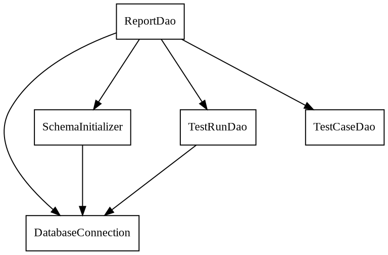

**Таблица. Описание классов пакета «Data»**

| Класс                | Описание                                                                                                                |
| -------------------- | ----------------------------------------------------------------------------------------------------------------------- |
| `ReportDao`          | **Фасад** над пакетом. Публичный API: `saveRun(result)` и `getAllRuns()`. Композирует connection, DAO и инициализатор схемы. |
| `DatabaseConnection` | Управление JDBC-соединением. Хранит URL (`jdbc:sqlite:autotestgen.db`), метод `open()` возвращает новое `Connection`.    |
| `SchemaInitializer`  | DDL: создаёт таблицы `test_run` и `test_case` через `CREATE TABLE IF NOT EXISTS`. Вызывается из конструктора `ReportDao`.|
| `TestRunDao`         | DAO таблицы `test_run`. Методы `insert(conn, result): long` (возвращает сгенерированный `id`) и `selectAll(conn)`.       |
| `TestCaseDao`        | DAO таблицы `test_case`. Методы `insertBatch(conn, runId, cases)` и `selectByRunId(conn, runId)`.                       |

##### Диаграммы последовательностей

**Нормальный ход событий:**
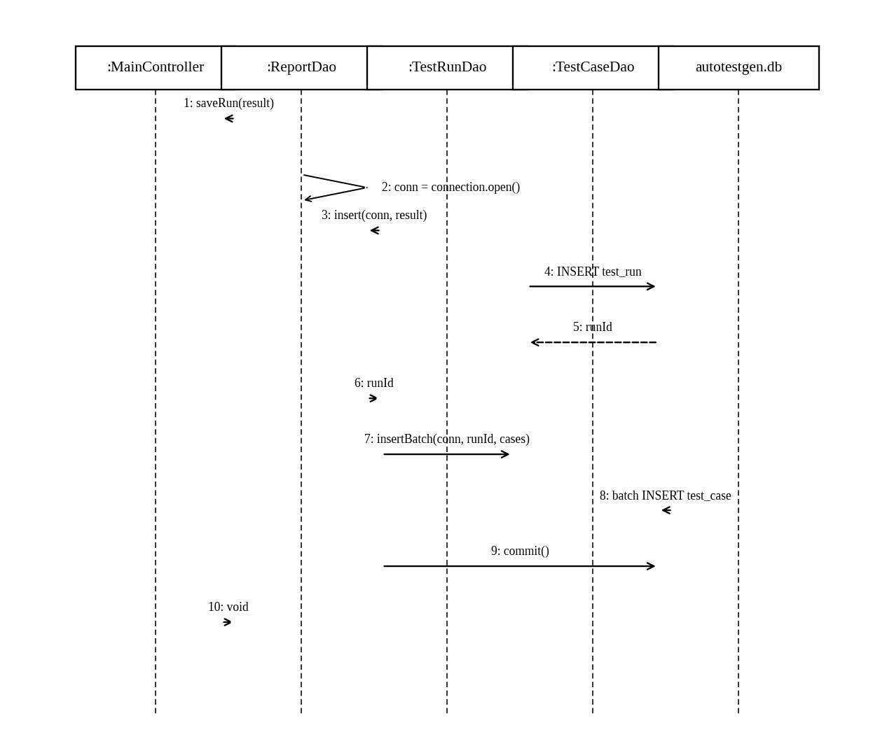

**Прерывание пользователем:**
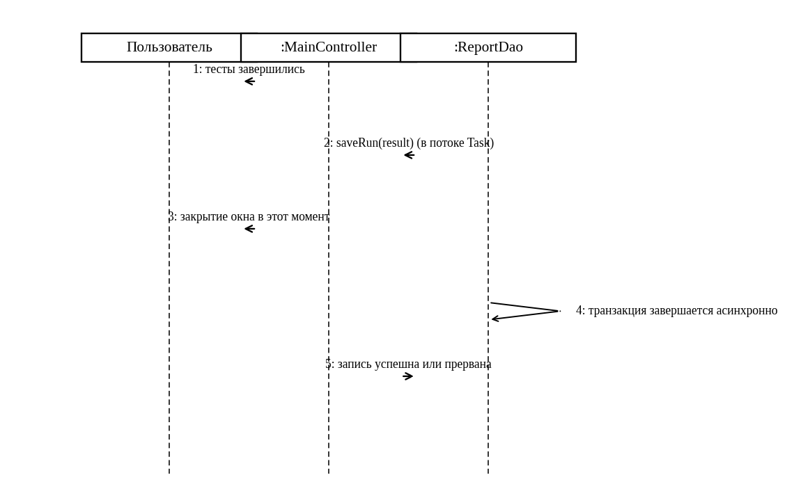

**Прерывание системой:**
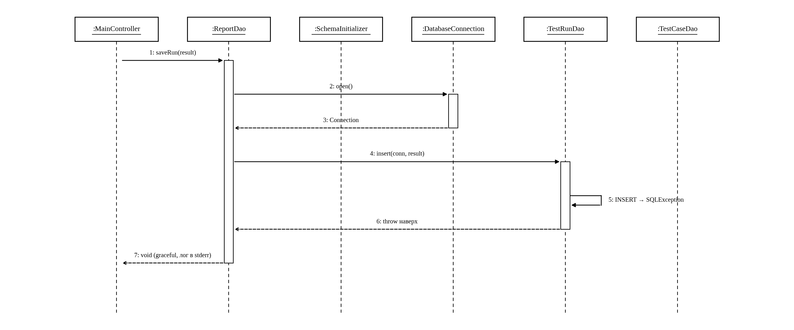

##### Диаграмма кооперации
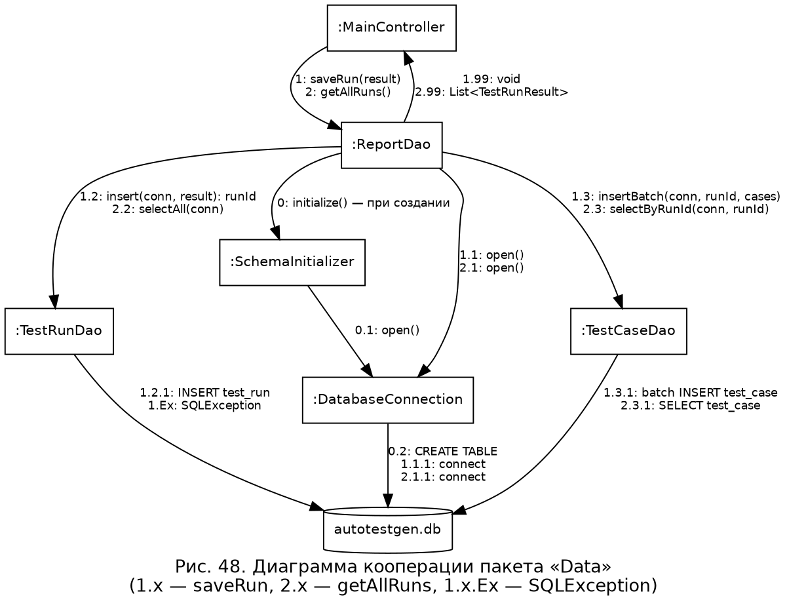

##### Уточнённая диаграмма классов
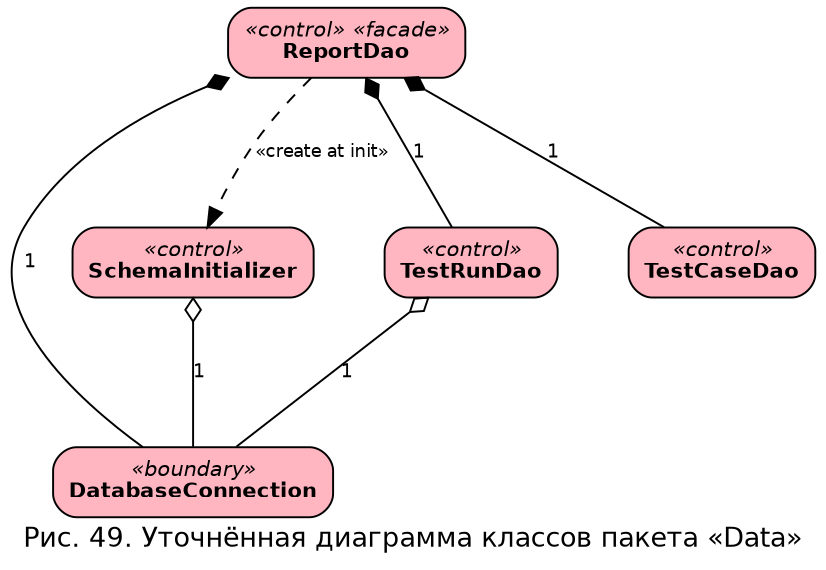

##### Детальная диаграмма классов
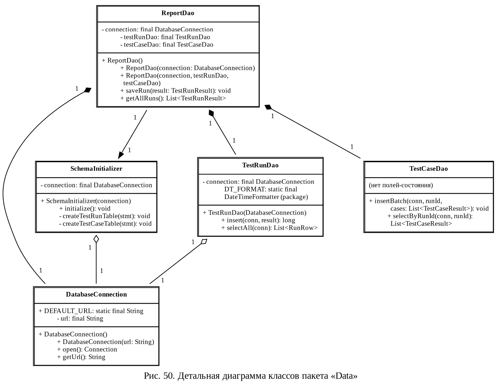

**Таблица. Описание полей класса «DatabaseConnection»**

| Название      | Тип                  | Описание                                                                 |
| ------------- | -------------------- | ------------------------------------------------------------------------ |
| `DEFAULT_URL` | `static final String`| Стандартный JDBC-URL `"jdbc:sqlite:autotestgen.db"`.                     |
| `url`         | `final String`       | Фактический URL, может быть переопределён через DI-конструктор.          |

**Таблица. Описание методов класса «DatabaseConnection»**

| Название              | Параметры        | Возвращаемое значение | Описание                                                                                   |
| --------------------- | ---------------- | --------------------- | ------------------------------------------------------------------------------------------ |
| `DatabaseConnection`  | —                | конструктор           | Использует `DEFAULT_URL = "jdbc:sqlite:autotestgen.db"`.                                  |
| `DatabaseConnection`  | `url: String`    | конструктор           | DI-конструктор с произвольным JDBC-URL (для тестов или резервных БД).                     |
| `open`                | —                | `Connection` throws `SQLException` | `DriverManager.getConnection(url)`.                                            |
| `getUrl`              | —                | `String`              | Возвращает текущий URL.                                                                    |

**Таблица. Описание полей класса «SchemaInitializer»**

| Название       | Тип                       | Описание                                                       |
| -------------- | ------------------------- | -------------------------------------------------------------- |
| `connection`   | `final DatabaseConnection`| Источник соединения для выполнения DDL.                        |

**Таблица. Описание методов класса «SchemaInitializer»**

| Название              | Параметры                                  | Возвращаемое значение | Описание                                                                          |
| --------------------- | ------------------------------------------ | --------------------- | --------------------------------------------------------------------------------- |
| `SchemaInitializer`   | `connection: DatabaseConnection`           | конструктор           | Сохраняет источник соединения.                                                    |
| `initialize`          | —                                          | `void`                | Открывает соединение и вызывает оба `createXxxTable`. Ошибки логируются в `stderr`.|
| `createTestRunTable`  | `stmt: Statement`                          | `private void` throws `SQLException` | DDL: `CREATE TABLE IF NOT EXISTS test_run (...)`.                          |
| `createTestCaseTable` | `stmt: Statement`                          | `private void` throws `SQLException` | DDL: `CREATE TABLE IF NOT EXISTS test_case (...)` с FK на `test_run`.      |

**Таблица. Описание полей класса «TestRunDao»**

| Название       | Тип                       | Описание                                                       |
| -------------- | ------------------------- | -------------------------------------------------------------- |
| `DT_FORMAT`    | `static final DateTimeFormatter` (package-private) | Формат сериализации даты `ISO_LOCAL_DATE_TIME`. |
| `INSERT_SQL`   | `private static final String` | Параметризованный SQL-INSERT для `test_run`.               |
| `SELECT_ALL_SQL` | `private static final String` | SQL для выборки всех прогонов в порядке убывания `id`.   |
| `connection`   | `final DatabaseConnection`| Источник соединения.                                           |

**Таблица. Описание методов класса «TestRunDao»**

| Название    | Параметры                                                  | Возвращаемое значение | Описание                                                                                |
| ----------- | ---------------------------------------------------------- | --------------------- | --------------------------------------------------------------------------------------- |
| `TestRunDao`| `connection: DatabaseConnection`                           | конструктор           | Сохраняет источник соединения.                                                          |
| `insert`    | `conn: Connection, result: TestRunResult`                  | `long` throws `SQLException` | INSERT в `test_run`, возвращает сгенерированный `id` через `RETURN_GENERATED_KEYS`. |
| `selectAll` | `conn: Connection`                                         | `List<RunRow>` throws `SQLException` | `SELECT * FROM test_run ORDER BY id DESC`. Возвращает пары (id, заполненный `TestRunResult` без `results`). |

**Таблица. Описание полей класса «TestCaseDao»**

| Название            | Тип                       | Описание                                                       |
| ------------------- | ------------------------- | -------------------------------------------------------------- |
| `INSERT_SQL`        | `private static final String` | Параметризованный SQL-INSERT для `test_case`.              |
| `SELECT_BY_RUN_SQL` | `private static final String` | SQL для выборки кейсов конкретного прогона по `run_id`.    |

**Таблица. Описание методов класса «TestCaseDao»**

| Название         | Параметры                                                            | Возвращаемое значение | Описание                                                                |
| ---------------- | -------------------------------------------------------------------- | --------------------- | ----------------------------------------------------------------------- |
| `insertBatch`    | `conn: Connection, runId: long, cases: List<TestCaseResult>`         | `void` throws `SQLException` | Batch-INSERT в `test_case` по уже известному `run_id`.            |
| `selectByRunId`  | `conn: Connection, runId: long`                                      | `List<TestCaseResult>` throws `SQLException` | `SELECT * FROM test_case WHERE run_id = ? ORDER BY id`.        |

**Таблица. Описание полей класса «ReportDao»**

| Название       | Тип                       | Описание                                                       |
| -------------- | ------------------------- | -------------------------------------------------------------- |
| `connection`   | `final DatabaseConnection`| Композирует — источник соединения для всех операций.           |
| `testRunDao`   | `final TestRunDao`        | Композирует — DAO таблицы `test_run`.                          |
| `testCaseDao`  | `final TestCaseDao`       | Композирует — DAO таблицы `test_case`.                         |

**Таблица. Описание методов класса «ReportDao»**

| Название           | Параметры                                                                                  | Возвращаемое значение | Описание                                                                                   |
| ------------------ | ------------------------------------------------------------------------------------------ | --------------------- | ------------------------------------------------------------------------------------------ |
| `ReportDao`        | —                                                                                          | конструктор           | Создаёт DAO со стандартным `DatabaseConnection` и вызывает `SchemaInitializer.initialize`. |
| `ReportDao`        | `connection: DatabaseConnection`                                                            | конструктор           | DI-конструктор для подмены источника соединения в тестах.                                  |
| `ReportDao`        | `connection: DatabaseConnection, testRunDao: TestRunDao, testCaseDao: TestCaseDao`         | конструктор           | Полный DI-конструктор.                                                                     |
| `saveRun`          | `result: TestRunResult`                                                                    | `void`                | Транзакция: `setAutoCommit(false)` → `testRunDao.insert` → `testCaseDao.insertBatch` → `commit`. `SQLException` логируется. |
| `getAllRuns`       | —                                                                                          | `List<TestRunResult>` | Открывает одно соединение, через `testRunDao.selectAll` получает заголовки, для каждого вызывает `testCaseDao.selectByRunId`. |

---

#### 1.5.2.6. Пакет «Common»

##### Исходная диаграмма классов
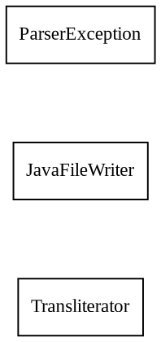

**Таблица. Описание классов пакета «Common»**

| Класс             | Описание                                                                                                                |
| ----------------- | ----------------------------------------------------------------------------------------------------------------------- |
| `Transliterator`  | Static-утилита транслитерации Cyrillic → Latin Java-идентификаторов: PascalCase, camelCase, snake-to-camel.              |
| `JavaFileWriter`  | Fluent-билдер исходного Java-файла с управлением отступом: `writeLine`, `openBlock`, `closeBlock`, `writeToFile`.       |
| `ParserException` | Доменное checked-исключение для оборачивания технических ошибок парсинга XML.                                            |

##### Диаграммы последовательностей

**Нормальный ход событий:**
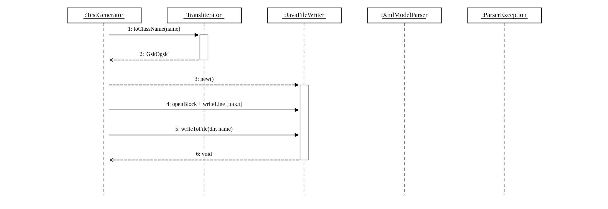

**Прерывание пользователем:**
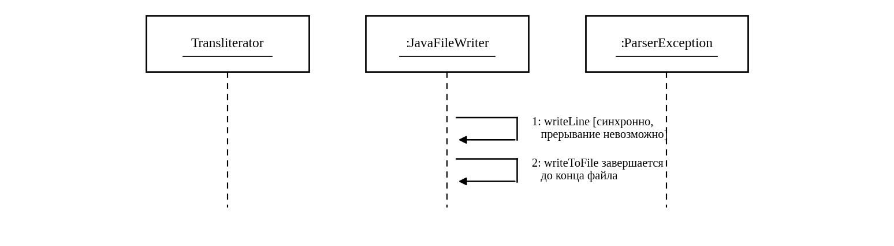

**Прерывание системой:**
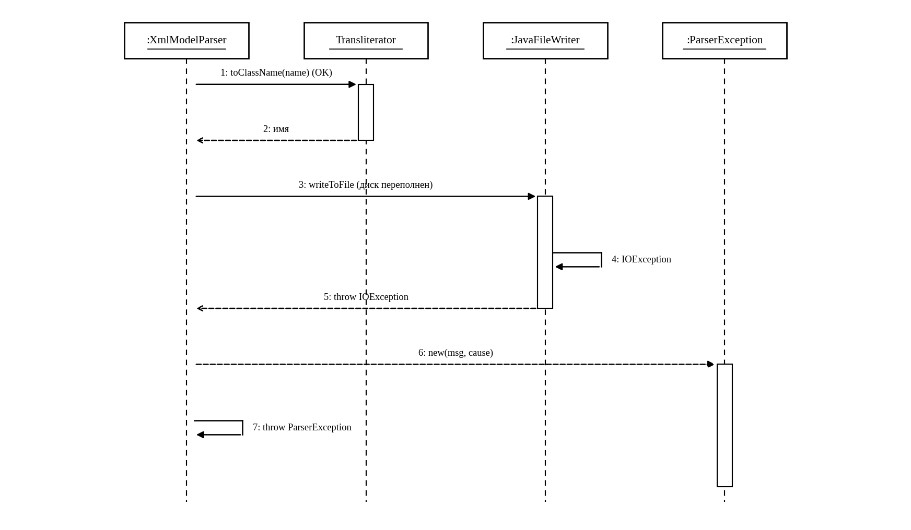

##### Диаграмма кооперации
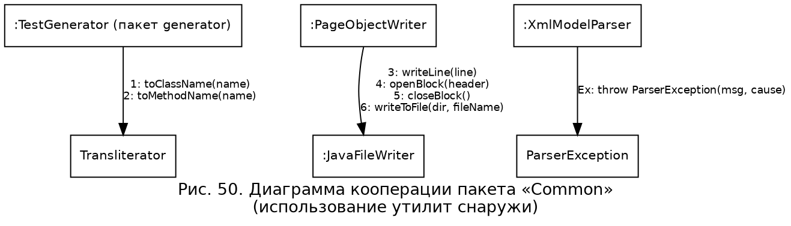

##### Уточнённая диаграмма классов
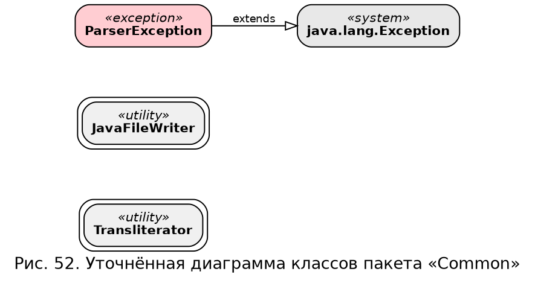

##### Детальная диаграмма классов
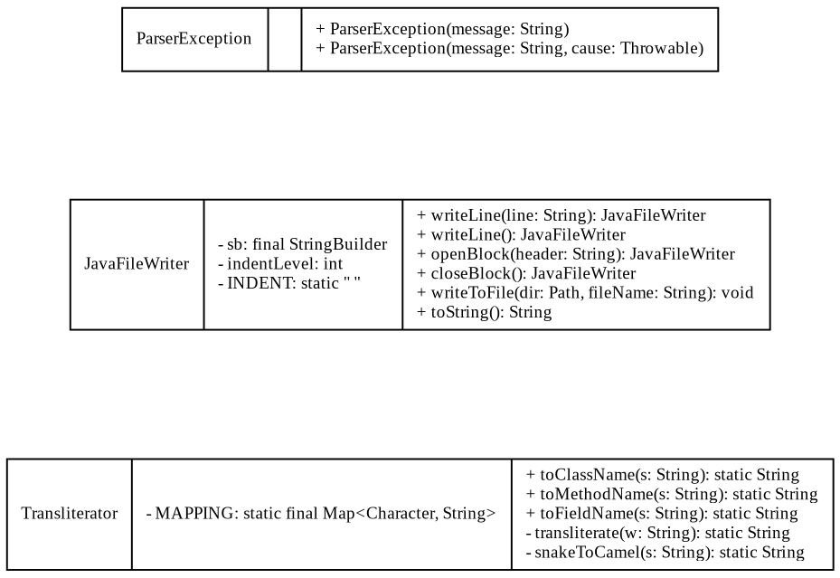

**Таблица. Описание полей класса «JavaFileWriter»**

| Название        | Тип                       | Описание                                                  |
| --------------- | ------------------------- | --------------------------------------------------------- |
| `sb`            | `final StringBuilder`     | Аккумулятор содержимого файла.                            |
| `indentLevel`   | `int`                     | Текущий уровень отступа (4 пробела на уровень).           |
| `INDENT`        | `static final String`     | Префикс отступа `"    "` (4 пробела).                     |

**Таблица. Описание методов класса «Transliterator»**

| Название         | Параметры              | Возвращаемое значение | Описание                                                                                  |
| ---------------- | ---------------------- | --------------------- | ----------------------------------------------------------------------------------------- |
| `toClassName`    | `russianName: String`  | `static String`       | Cyrillic → PascalCase. «ГСК/ОГСК» → `GskOgsk`.                                            |
| `toMethodName`   | `russianName: String`  | `static String`       | То же, но первая буква строчная.                                                          |
| `toFieldName`    | `attrName: String`     | `static String`       | Если уже Latin (`KEY_GB_SOCIETY`) — snake→camelCase, иначе как `toMethodName`.            |
| `transliterate`  | `word: String`         | `private static String` | Перевод слова посимвольно через `MAPPING`.                                              |
| `snakeToCamel`   | `snake: String`        | `private static String` | Конвертит `KEY_GB_SOCIETY` → `keyGbSociety`.                                            |

**Таблица. Описание методов класса «JavaFileWriter»**

| Название      | Параметры                          | Возвращаемое значение | Описание                                                                          |
| ------------- | ---------------------------------- | --------------------- | --------------------------------------------------------------------------------- |
| `writeLine`   | `line: String`                     | `JavaFileWriter`      | Дописывает строку с текущим отступом + `\n`. Fluent (возвращает себя).            |
| `writeLine`   | —                                  | `JavaFileWriter`      | Пустая строка-разделитель. Fluent.                                                |
| `openBlock`   | `header: String`                   | `JavaFileWriter`      | `writeLine(header + " {")` и `indentLevel++`. Fluent.                              |
| `closeBlock`  | —                                  | `JavaFileWriter`      | `indentLevel--` и `writeLine("}")`. Fluent.                                        |
| `indent`      | —                                  | `JavaFileWriter`      | `indentLevel++` без записи. Fluent.                                                |
| `unindent`    | —                                  | `JavaFileWriter`      | `indentLevel--` без записи. Fluent.                                                |
| `writeToFile` | `dir: Path, fileName: String`      | `void` throws `IOException` | `Files.createDirectories(dir)` + запись содержимого в UTF-8.                      |
| `toString`    | —                                  | `String`              | Возвращает накопленное содержимое (для логирования / тестов).                     |

**Таблица. Описание методов класса «ParserException»**

| Название           | Параметры                              | Возвращаемое значение | Описание                                       |
| ------------------ | -------------------------------------- | --------------------- | ---------------------------------------------- |
| `ParserException`  | `message: String`                      | конструктор           | Создаёт checked-исключение с сообщением.       |
| `ParserException`  | `message: String, cause: Throwable`    | конструктор           | То же + причина (для wrap-pattern).            |

---

### 1.5.3. Модульная структура (по Л. Константайну)

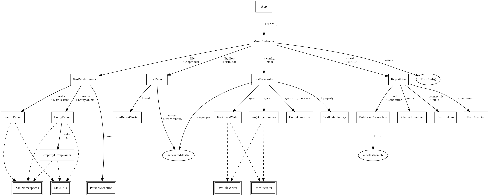

**Таблица 92. Спецификация модулей программы** *(для §1.5.3 — краткая форма)*

| Название                     | Входные параметры                                         | Выходные параметры                            | Описание                                                                                |
| ---------------------------- | --------------------------------------------------------- | --------------------------------------------- | --------------------------------------------------------------------------------------- |
| `App.java`                   | `args: String[]`                                          | окно GUI                                       | Точка входа, инициализация JavaFX и загрузка FXML.                                       |
| `MainController.java`        | FXML-элементы, действия пользователя                       | UI-обновления, побочные эффекты               | Контроллер главного окна, центральный координатор всех сценариев.                       |
| `AppModel.java`              | (наполняется парсером)                                     | объект модели                                  | Корень объектной модели метаданных.                                                      |
| `EntityObject.java`          | GUID, имя, ассоциации, группы свойств                      | объект сущности                                | Бизнес-сущность модели (карточка).                                                       |
| `PropertyGroup.java`         | GUID, тип, поля, операция                                  | объект группы свойств                          | Группа полей формы или Grid-вкладки.                                                     |
| `Property.java`              | GUID, имя, тип, маска, обязательность                      | объект поля                                    | Описание одного поля формы.                                                              |
| `Operation.java`             | метод, модуль, параметры, модификаторы                     | объект операции                                | Серверная операция формы.                                                                |
| `OperationParam.java`        | имя, типы                                                  | объект параметра                               | Один параметр серверной операции.                                                        |
| `Modifier.java`              | заголовок, тип модификации                                 | объект модификатора                            | Кнопка-модификатор формы.                                                                |
| `ModifyType.java`            | код буквы                                                  | константа enum                                 | Тип модификации (INSERT, UPDATE, DELETE, LOGICAL_EDIT, ARCHIVE).                         |
| `Association.java`           | GUID, роли, FK-данные                                      | объект ассоциации                              | Связь сущностей (FK или дочерняя коллекция).                                             |
| `Search.java`                | имя, GUID объекта, query, параметры                        | объект поиска                                  | Параметрический поиск сущности.                                                          |
| `SearchParam.java`           | имя, тип, маска, обязательность                            | объект параметра                               | Поле формы поиска.                                                                       |
| `SearchResult.java`          | колонки результата                                         | объект описания грида                          | Описание грида-результата поиска.                                                        |
| `SearchResultProperty.java`  | имя, заголовок, тип, видимость                             | объект колонки                                 | Колонка грида результата.                                                                |
| `AttrType.java`              | строка XML                                                 | константа enum                                  | Тип атрибута (STRING / DECIMAL / DATE / DATETIME).                                       |
| `EntityKind.java`            | —                                                          | константа enum                                  | Логическая роль сущности (PRIMARY / CHILD / REFERENCE_DICTIONARY).                       |
| `EntityClassifier.java`      | `EntityObject`, `AppModel`                                 | `Classification`                                | Определяет роль сущности по структуре XML.                                               |
| `TestRunResult.java`         | счётчики, список кейсов                                    | объект результата прогона                       | Контейнер результатов прогона тестов.                                                    |
| `TestCaseResult.java`        | класс, метод, статус, длительность, скриншоты              | объект результата теста                         | Контейнер результата одного тест-метода.                                                 |
| `XmlModelParser.java`        | `File` XML, опционально `EntityParser`+`SearchParser`     | `AppModel` или `ParserException`               | Фасад/координатор парсинга XML-модели.                                                   |
| `EntityParser.java`          | `XMLStreamReader`                                          | `EntityObject` или `Association`                | Парсер `<Object>` и `<AssociationObjectA>`.                                              |
| `PropertyGroupParser.java`   | `XMLStreamReader`                                          | `PropertyGroup`                                 | Парсер `<Properties>` со всеми `<Property>` и `<Operation>`.                             |
| `SearchParser.java`          | `XMLStreamReader`                                          | `List<Search>`                                  | Парсер `<Searches>` со всеми вложенными элементами.                                      |
| `StaxUtils.java`             | `XMLStreamReader`, имя атрибута                            | значение / int / `void`                         | Утилиты для StAX: чтение атрибутов, парсинг int, перемотка курсора.                      |
| `XmlNamespaces.java`         | —                                                          | константы строк                                 | URI namespace-ов формата E3Core.                                                         |
| `Transliterator.java`        | русское имя                                                | Java-идентификатор                              | Транслитерация имён сущностей в имена классов/методов.                                   |
| `JavaFileWriter.java`        | строки кода                                                | файл `.java`                                    | Билдер форматированного Java-исходника.                                                  |
| `ParserException.java`       | сообщение, причина                                         | объект-исключение                               | Доменное исключение для ошибок парсинга.                                                 |
| `ReportDao.java`             | `TestRunResult` (для записи); — (для чтения)               | `void` или `List<TestRunResult>`                | Фасад над пакетом data. Транзакционно записывает прогон и читает историю.                |
| `DatabaseConnection.java`    | URL (опционально)                                          | `java.sql.Connection`                           | Открытие JDBC-соединения, единый источник правды для URL.                                 |
| `SchemaInitializer.java`     | `DatabaseConnection`                                       | `void` (создаёт таблицы)                        | DDL: `CREATE TABLE IF NOT EXISTS` для `test_run` и `test_case`.                          |
| `TestRunDao.java`            | `Connection`, `TestRunResult`                              | `long` (id) или `List<RunRow>`                  | INSERT/SELECT для таблицы `test_run`.                                                     |
| `TestCaseDao.java`           | `Connection`, `runId`, `List<TestCaseResult>`              | `void` или `List<TestCaseResult>`               | Batch-INSERT и выборка кейсов конкретного прогона из `test_case`.                         |
| `TestConfig.java`            | URL, логин, пароль, каталог, уровень тестов                | объект-настройки                                | Контейнер параметров генерации.                                                          |
| `TestGenerator.java`         | `AppModel`, `TestConfig`                                   | каталог `generated-tests/` с проектом           | Дирижёр генерации тестового проекта.                                                     |
| `PageObjectWriter.java`      | `EntityObject`, `TestConfig`                               | `.java` Page Object                             | Генератор Page Object Java-классов.                                                      |
| `TestClassWriter.java`       | `EntityObject`, `AppModel`, `TestConfig`                   | `.java` тест-класс                              | Генератор JUnit-5 тест-классов.                                                          |
| `TestDataFactory.java`       | `Property` / `SearchParam`                                 | строка-значение или выражение                   | Фабрика тестовых значений по типу и маске.                                               |
| `TestRunner.java`            | `Path` каталога, фильтр Surefire, режим                    | `TestRunResult`                                 | Запуск `mvn test` через `ProcessBuilder` + парсинг Surefire-XML-отчётов.                 |
| `RunReportWriter.java`       | `TestRunResult`, путь к выходным файлам                    | `.html`, `.csv` отчёты                          | Кастомный HTML-отчёт v5 с фотолетописью + CSV-выгрузка.                                  |

---

### 1.5.4. Диаграмма размещения

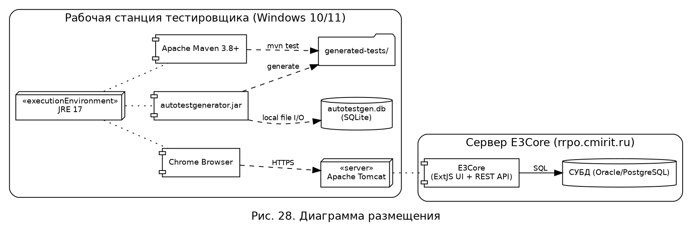

---

### 1.5.5. Диаграмма компонентов

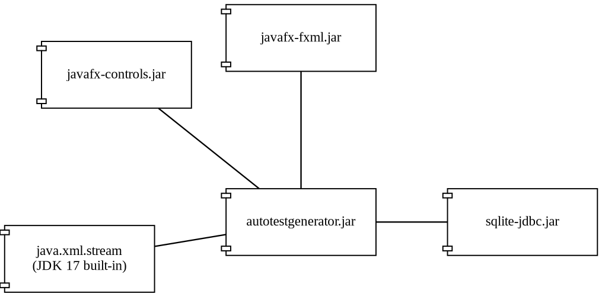

---

## Приложение 3. Спецификация программной документации и программного обеспечения

**Таблица П3.1. Спецификация программной документации и программного обеспечения** *(детальная форма для Прил. 3)*

| Название модуля              | Назначение                                       | Входные параметры                                                | Выходные параметры                                  | Описание                                                                                                                                                | Зависимости                                                  |
| ---------------------------- | ------------------------------------------------ | ---------------------------------------------------------------- | --------------------------------------------------- | ------------------------------------------------------------------------------------------------------------------------------------------------------- | ------------------------------------------------------------ |
| `App.java`                   | Точка входа JavaFX-приложения                    | `args: String[]`                                                 | Окно GUI (Stage)                                    | Главный класс. Метод `main` вызывает `launch(args)`, затем JavaFX вызывает `start(stage)` — загружается `main.fxml` через `FXMLLoader`, создаётся сцена 1000×700, показывается окно. | `MainController`, ресурс `main.fxml`                          |
| `MainController.java`        | FXML-контроллер главного окна                    | События UI (клики, выбор файла, заполнение полей)                | Обновления элементов UI, побочные эффекты            | Центральный координатор: создаёт `XmlModelParser` в `onParse`, `TestGenerator` в `onGenerate`, `TestRunner` в `launchRun`. Управляет `Task` фоновых задач, обновляет таблицу через `displayResults`, журналирует через `log`, показывает ошибки через `showAlert`. | `XmlModelParser`, `TestGenerator`, `TestConfig`, `TestRunner`, `ReportDao`, `Transliterator` |
| `AppModel.java`              | Корень объектной модели метаданных               | (наполняется парсером)                                           | Объектная модель                                     | Хранит список `EntityObject`, список `Search`, имя категории и GUID. Метод `findEntityByGuid` для навигации по ссылкам, `getSubsystemNameFromCategory` — для извлечения имени подсистемы из `CategoryName`. | `EntityObject`, `Search`                                      |
| `EntityObject.java`          | Бизнес-сущность модели                            | GUID, имя, ключевые атрибуты                                     | POJO-объект сущности                                 | Карточка предметной области E3Core: GUID, имя, `keyName`, `featureName`, `nameValueMethod`. Содержит вложенные списки `Association` (связи) и `PropertyGroup` (вкладки/гриды). Метод `hasCrudOperations` — есть ли CRUD-кнопки, `getFormView` — основная форма. | `Association`, `PropertyGroup`                                |
| `PropertyGroup.java`         | Группа свойств сущности                           | GUID, тип, поля, операция                                        | POJO-объект группы                                   | Группа полей формы (`typeLink="P"`) или Grid-вкладка (`stereoType="Grid"`). Содержит список `Property` и `Operation`. Методы `isFormView` и `isGridView` различают типы.                          | `Property`, `Operation`                                       |
| `Property.java`              | Описание одного поля формы                        | GUID, имя, тип, маска, обязательность                            | POJO-объект поля                                     | Атрибут БД + UI-метаданные: `attrName`, `tableName`, `attrType`, `required`, `mask`, `defValueSource`. Используется парсером и генератором.                                                       | `AttrType`                                                    |
| `Operation.java`             | Серверная операция формы                          | Метод, модуль, параметры, модификаторы                           | POJO-объект операции                                 | Описывает серверную операцию: имя метода, модуль, список `OperationParam` и список `Modifier` (кнопок).                                                                                            | `OperationParam`, `Modifier`                                  |
| `OperationParam.java`        | Параметр серверной операции                       | Имя, тип параметра, тип значения                                 | POJO-объект параметра                                | Описание одного параметра при вызове серверной операции (in/out).                                                                                                                                  | —                                                             |
| `Modifier.java`              | Кнопка-модификатор формы                          | Заголовок, тип модификации                                       | POJO-объект                                          | UI-кнопка типа «Создать», «Удалить» и её связь с `ModifyType`.                                                                                                                                      | `ModifyType`                                                  |
| `ModifyType.java`            | Перечисление типов модификации                    | Код буквы (`I`/`U`/`D`/`E`/`A`)                                  | Константа enum                                       | Стандартные типы CRUD: INSERT, UPDATE, DELETE, LOGICAL_EDIT, ARCHIVE. Метод `fromCode` парсит из XML.                                                                                                | —                                                             |
| `Association.java`           | Связь сущности с другой                           | GUID, роли, FK-данные                                            | POJO-объект ассоциации                               | FK-пикер или дочерняя коллекция через `associateItemGuid`. Флаги `flagDisplay` и `addFromTree` отличают навигационные связи от FK-целей.                                                            | —                                                             |
| `Search.java`                | Параметрический поиск сущности                    | Имя, GUID объекта, query, параметры                              | POJO-объект поиска                                   | Метаданные поиска E3Core: SQL-запрос, минимальное число параметров, список `SearchParam`, описание грида результата `SearchResult`.                                                                | `SearchParam`, `SearchResult`                                 |
| `SearchParam.java`           | Поле формы поиска                                 | Имя, тип, маска, обязательность                                  | POJO-объект параметра                                | Описание одного поля поиска: имя, заголовок, тип значения, маска, обязательность.                                                                                                                  | —                                                             |
| `SearchResult.java`          | Описание грида результата поиска                  | Имя ID-объекта, колонки                                          | POJO-объект                                          | Имя ID-объекта результата и список колонок `SearchResultProperty`.                                                                                                                                 | `SearchResultProperty`                                        |
| `SearchResultProperty.java`  | Колонка в гриде результата                        | Имя, заголовок, тип, видимость                                   | POJO-объект колонки                                  | Описание одной колонки таблицы результатов поиска.                                                                                                                                                 | —                                                             |
| `AttrType.java`              | Тип атрибута поля                                 | Строка XML                                                       | Константа enum                                       | STRING / DECIMAL / DATE / DATETIME. Метод `fromXml` парсит атрибут из XML.                                                                                                                          | —                                                             |
| `EntityKind.java`            | Логическая роль сущности                          | —                                                                | Константа enum                                       | PRIMARY (главная) / CHILD (дочерняя) / REFERENCE_DICTIONARY (справочник). Определяет генерируется ли отдельный тест-класс.                                                                          | —                                                             |
| `EntityClassifier.java`      | Классификатор сущностей                            | `EntityObject`, `AppModel`                                       | `Classification`                                     | Static-классификатор: `classify(entity, model)` определяет `EntityKind` сущности по цепочке правил (поиск родительского Grid, проверка featureName V_S_, проверка пустых параметров поисков). Используется генератором для пропуска не-PRIMARY-сущностей. | `AppModel`, `EntityObject`, `PropertyGroup`, `EntityKind`     |
| `TestRunResult.java`         | Результат прогона тестов                          | Счётчики, список кейсов                                          | POJO-объект                                          | Контейнер результата `mvn test`: total/passed/failed/skipped, timestamp, duration, список `TestCaseResult`, полный stdout.                                                                          | `TestCaseResult`                                              |
| `TestCaseResult.java`        | Результат одного тест-метода                      | Класс, метод, статус, длительность, скриншоты                     | POJO-объект                                          | Контейнер одного `@Test`-метода: имя класса/метода, passed/skipped, длительность, stdout, скриншоты, шаги.                                                                                          | —                                                             |
| `XmlModelParser.java`        | Фасад/координатор парсера XML                     | `File` XML, опционально DI-зависимости                            | `AppModel` или `ParserException`                     | Открывает StAX-reader, в цикле распознаёт top-level элементы `<Category>`, `<Object>`, `<Searches>` и делегирует разбор специализированным парсерам. Оборачивает `IOException` и `XMLStreamException` в `ParserException`. | `EntityParser`, `SearchParser`, `AppModel`, `ParserException` |
| `EntityParser.java`          | Парсер сущности и ассоциаций                       | `XMLStreamReader`                                                | `EntityObject` или `Association`                     | Читает `<Object>` целиком: создаёт `EntityObject`, заполняет атрибуты, для вложенных `<Properties>` делегирует в `PropertyGroupParser`, для `<AssociationObjectA>` вызывает приватный `parseAssociation`.   | `PropertyGroupParser`, `StaxUtils`, `XmlNamespaces`            |
| `PropertyGroupParser.java`   | Парсер группы свойств                              | `XMLStreamReader`                                                | `PropertyGroup`                                      | Читает `<Properties>` со всеми вложенными `<Property>` и `<Operation>`. Заполняет тип группы, флаги отображения, порядок. Курсор оставляет на закрывающем теге.                                       | `StaxUtils`, `XmlNamespaces`, `AttrType`                      |
| `SearchParser.java`          | Парсер поисков                                     | `XMLStreamReader`                                                | `List<Search>`                                       | Читает `<Searches>` со всеми `<Search>`, для каждого — `<SearchParam>`, `<SearchResult>`, `<SearchResultProperty>`.                                                                                  | `StaxUtils`, `XmlNamespaces`                                  |
| `StaxUtils.java`             | Утилиты для StAX                                   | `XMLStreamReader`, имя атрибута                                  | Значение / int / `void`                              | Static-утилиты: `attr(reader, name)` — безопасное чтение атрибута, `parseInt(value)` — безопасный парсинг int, `skipToEnd(reader)` — перемотка курсора до закрытия текущего элемента.                  | —                                                             |
| `XmlNamespaces.java`         | Константы NS XML-формата                           | —                                                                | Константы строк                                      | URI namespace-ов формата E3Core: `NS_E`, `NS_E3`, `NS_MD`. Единый источник правды для проверки origin элемента.                                                                                       | —                                                             |
| `Transliterator.java`        | Транслитерация имён                                | Русское имя                                                       | Java-идентификатор                                   | Static-утилита: Cyrillic → PascalCase / camelCase / snake-to-camel. Используется для генерации имён сгенерированных классов и методов.                                                                | —                                                             |
| `JavaFileWriter.java`        | Билдер Java-исходника                              | Строки кода                                                       | Файл `.java`                                          | Fluent-билдер с управлением отступом: `writeLine`, `openBlock`, `closeBlock`, `indent`, `unindent`, `writeToFile`. Используется генератором для построения каждого `.java`-файла.                       | —                                                             |
| `ParserException.java`       | Доменное исключение парсинга                       | Сообщение, причина                                                | Объект-исключение                                    | Checked-исключение для оборачивания технических ошибок (`IOException`, `XMLStreamException`) на границе парсера.                                                                                       | —                                                             |
| `ReportDao.java`             | Фасад над пакетом data                             | `TestRunResult` (для записи); — (для чтения)                       | `void` или `List<TestRunResult>`                     | Композирует `DatabaseConnection`, `TestRunDao`, `TestCaseDao`. Открывает транзакцию `setAutoCommit(false)`, последовательно вызывает `testRunDao.insert` и `testCaseDao.insertBatch`, в конце `commit`. `getAllRuns` собирает прогоны со всеми кейсами. При создании запускает `SchemaInitializer`. | `DatabaseConnection`, `SchemaInitializer`, `TestRunDao`, `TestCaseDao` |
| `DatabaseConnection.java`    | Управление JDBC-соединением                        | URL (опционально)                                                 | `java.sql.Connection`                                | Единый источник правды для JDBC-URL: `DEFAULT_URL = "jdbc:sqlite:autotestgen.db"`. Метод `open()` возвращает новое `Connection` через `DriverManager`. DI-конструктор позволяет подменить URL для тестов. | —                                                             |
| `SchemaInitializer.java`     | Инициализация схемы БД                             | `DatabaseConnection`                                              | `void`                                               | DDL: `CREATE TABLE IF NOT EXISTS test_run` и `test_case`. Вызывается из конструктора `ReportDao`. Ошибки логируются в `stderr`, не пробрасываются.                                                       | `DatabaseConnection`                                          |
| `TestRunDao.java`            | DAO таблицы `test_run`                             | `Connection`, `TestRunResult`                                     | `long` (id) или `List<RunRow>`                       | INSERT в `test_run` с `RETURN_GENERATED_KEYS` для получения `id`. SELECT ALL с парами (id, заполненный `TestRunResult` без `results`).                                                                  | `DatabaseConnection`, `TestRunResult`                         |
| `TestCaseDao.java`           | DAO таблицы `test_case`                            | `Connection`, `runId`, `List<TestCaseResult>`                     | `void` или `List<TestCaseResult>`                    | Batch INSERT в `test_case` и SELECT по `run_id`. Состояния не хранит, методы принимают `Connection` параметром.                                                                                          | `TestCaseResult`                                              |
| `TestConfig.java`            | Контейнер настроек генерации                       | URL, логин, пароль, каталог, уровень тестов                       | POJO-объект настроек                                 | Параметры передаваемые `TestGenerator`: `baseUrl`, `login`, `password`, `outputDir`, `browserType`, `basePackage`, `siteType`, `subsystemName`, `testLevel`, `smokeAllSubsystems`. Геттеры/сеттеры для всех 10 полей. | —                                                             |
| `TestGenerator.java`         | Дирижёр генерации тестового проекта                | `AppModel`, `TestConfig`                                          | Каталог `generated-tests/` с проектом                | Главный метод `generate(model)`: пишет `pom.xml`, `BaseTest.java`, `SharedDriver.java`, `TestData.java`. Для каждой PRIMARY-сущности (через `EntityClassifier`) создаёт PageObject и TestClass через writer-ы. Опционально smoke-тест по подсистемам. | `PageObjectWriter`, `TestClassWriter`, `TestDataFactory`, `EntityClassifier` |
| `PageObjectWriter.java`      | Генератор Page Object Java-классов                 | `EntityObject`, `Path` каталога                                   | `.java` файл Page Object                              | Генерирует класс `XxxPage` с методами `open()`, `clickCreate()`, `fillField()`, `clickSave()`, `getFieldValue` и т.д. Скрывает работу с ExtJS PropertyGrid через Strategy A (rec.set) + Strategy B (DOM editor). Двойная стратегия для FK-полей через ExtJS-комбобокс. | `JavaFileWriter`, `Transliterator`, `TestDataFactory`         |
| `TestClassWriter.java`       | Генератор JUnit-5 тест-классов                     | `EntityObject`, `AppModel`, `Path` каталога                       | `.java` файл тест-класса                              | Генерирует класс `XxxTest` с JUnit5-методами по уровню тестов: testCreate, testCreateOnlyRequired, testUpdate, testDelete, testLogicalEdit, testArchive, testFieldsPresent, testRequiredFieldValidation, testPartialRequiredFieldValidation, testSearch*, testGrid*. Особый случай — `writeChildTest` для CHILD-сущностей. | `JavaFileWriter`, `Transliterator`, `TestDataFactory`         |
| `TestDataFactory.java`       | Фабрика тестовых значений                          | `Property` / `SearchParam`                                        | Строка-значение или Java-выражение                    | Static-методы: `generateValue(prop)` подбирает значение по `AttrType` и `mask`. `generateFromMask(mask)` для произвольных масок. `generateValueExpression(prop)` возвращает Java-код, который вычислит значение в runtime теста. Эвристики `looksLikeDateMask`. | `Property`, `AttrType`                                        |
| `TestRunner.java`            | Запуск Maven Surefire                              | `Path` каталога, фильтр Surefire, режим fastMode                  | `TestRunResult`                                      | `ProcessBuilder("mvn", "test", "-Dtest=...", ["-DforkCount=3", "-Dheadless=true"])`. Читает stdout построчно через `lineConsumer`. По завершении парсит `target/surefire-reports/*.xml` через StAX. В конце вызывает `RunReportWriter` для HTML+CSV. | `TestRunResult`, `RunReportWriter`                            |
| `RunReportWriter.java`       | Кастомный отчёт прогона                             | `TestRunResult`, путь к выходным файлам                            | `.html`, `.csv` отчёты                                | Генерирует HTML v5 с фотолетописью (скриншоты на каждом шаге), таблицей результатов, цветной подсветкой статусов. CSV-выгрузка для Excel. Static-утилиты для CSV-escape, HTML-escape, форматирования длительности. | `TestRunResult`, `TestCaseResult`                             |

---

## Итоги

- **6 пакетов** проекта: UI, Parser, Model, Generator, Data, Common
- **41 .java-файл** (24 модуля с поведением + 17 POJO в model)
- **Все диаграммы** в `diagrams/` готовы к печати (ч/б, Liberation Serif)
- **Полное соответствие** с актуальным кодом ветки vers2

Все диаграммы пересобираются скриптами:
- `diagrams/gen_seq.py` — все 18 ДПС
- `diagrams/gen_constantine.py` — модульная структура Константайна
- `diagrams/*.dot` — все остальные через graphviz (`dot -Tpng -Gdpi=140 X.dot -o X.png`)
