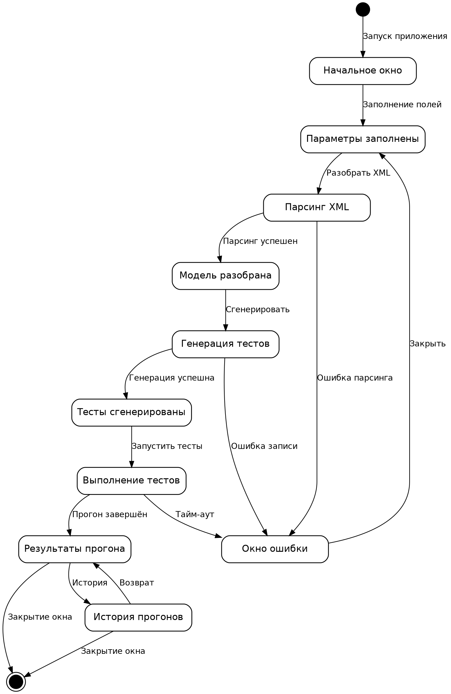

# Гайд по разделу 1.6 — как переписать ближе к Сафиуллину

## Структура раздела (как у него)

```
1.6. Проектирование интерфейса пользователя
    [абзац-введение: требования к интерфейсу]

    1.6.1. Построение графа диалога
        [абзац: определение графа диалога, зачем он нужен]
        [абзац: переход к собственному графу + ссылки на табл. 108, рис. 56, табл. 109]
        Таблица 108. Состояния интерфейса главного окна
        Рис. 56. Граф диалога информационной системы
        Таблица 109. Описание переходов между состояниями
        [абзац-вывод: возвратность, отсутствие тупиков, изоляция ошибок]

    1.6.2. Разработка форм ввода-вывода информации
        [абзац: на чём реализован UI и почему удобно]
        [абзац: главное окно + 5 секций + ссылка на руководство]
        Рис. 57. Главное окно
        [абзац-связка к остальным формам]
        Рис. 58–61. Окна параметров / сущностей / результатов / истории
```

---

## Новый граф диалога

Заменить старый mermaid-граф (S0–S9 кубиками) на UML-statechart:



**Подпись:** `Рис. 56. Граф диалога информационной системы`

**Что изменилось по сравнению с твоим текущим:**
- чёрный закрашенный кружок — начальное псевдосостояние;
- двойной кружок — финальное состояние;
- скруглённые прямоугольники с **человеческими названиями** вместо `S0`/`S1`;
- подписи действий на стрелках (`Заполнение полей`, `Разобрать XML`, `Закрыть` и т.д.);
- ошибки сходятся в один узел `Окно ошибки`, возврат — к параметрам.

> Коды `S0…S9` остаются в **таблицах 108 и 109** — там это нормально. В самом графе подписи должны быть осмысленными, как у Сафиуллина на рис. 23.

---

## Сравнение «что было — что станет»

| Блок | Сейчас у тебя | Как должно быть |
|---|---|---|
| 1.6 (введение) | 1 строка | Абзац про требования к UI (понятность, логичность, минимум действий) |
| 1.6.1 теория | 1 строка | 2 абзаца: определение графа диалога + переход к рис. |
| 1.6.1 рисунок | mermaid с S0…S9 | UML-statechart с русскими именами |
| 1.6.1 вывод | нет | Абзац про отсутствие тупиков и изоляцию ошибок |
| 1.6.2 | 1 строка + макет | Платформа → главное окно → секции → 3–4 формы |

---

## Готовый текст для вставки

### 1.6. Проектирование интерфейса пользователя

Пользовательский интерфейс информационной системы представляет собой совокупность программных и визуальных средств, обеспечивающих взаимодействие пользователя с разработанным программным комплексом. Качество проектирования интерфейса напрямую влияет на удобство эксплуатации системы, скорость освоения функциональных возможностей и общую эффективность выполнения автоматизируемых процессов генерации и запуска автотестов. К основным требованиям, предъявляемым к интерфейсу системы, относятся интуитивная понятность, логичность структуры, минимизация количества действий для достижения результата и предотвращение ошибочных действий пользователя.

### 1.6.1. Построение графа диалога

Для формального описания, визуализации и анализа структуры пользовательского взаимодействия применяется граф диалога. Данная модель представляет собой ориентированный граф, в котором вершинами являются экранные состояния системы, а дугами — управляющие команды и действия пользователя, инициирующие переход между указанными состояниями. Построение графа диалога позволяет проверить логическую целостность интерфейса, выявить избыточные либо тупиковые маршруты навигации, а также повысить удобство работы конечного пользователя.

С целью визуализации структуры интерфейса разрабатываемой информационной системы был построен граф диалога, отражающий навигационные связи между основными состояниями главного окна — от ввода параметров до просмотра истории прогонов автотестов. Перечень состояний приведён в табл. 108, граф диалога — на рис. 56, описание переходов — в табл. 109.

*[табл. 108 — оставить как есть]*


*Рис. 56. Граф диалога информационной системы*

*[табл. 109 — оставить как есть]*

Структура графа диалога построена таким образом, что пользователь на любом этапе работы может закрыть текущее окно и вернуться к этапу ввода параметров либо завершить работу с системой. Ошибочные ситуации (сбой парсинга, ошибка генерации, тайм-аут запуска) изолированы в отдельном состоянии S9, из которого предусмотрен возврат к редактированию параметров. Это обеспечивает отсутствие тупиковых маршрутов, снижает вероятность ошибок и повышает удобство эксплуатации разработанной системы.

### 1.6.2. Разработка форм ввода-вывода информации

Разработка интерфейса информационной системы выполнена на языке Python с использованием библиотеки `<твоя UI-библиотека>`, обеспечивающей кроссплатформенность, лаконичное визуальное оформление и рациональное использование рабочего пространства экрана. Применение данной технологии позволяет пользователю получить отзывчивый и предсказуемый интерфейс без необходимости установки сторонних компонентов.

Работа с системой начинается с главного окна (рис. 57), в котором сосредоточены все рабочие элементы. Интерфейс разделён на пять функциональных секций: параметры подключения и пути к XML-файлу, панель действий (кнопки разбора, генерации и запуска), список разобранных сущностей, таблица результатов прогона и журнал событий. Для более подробного изучения работы с программой представлено руководство пользователя в прил. `<номер>`.

*Рис. 57. Главное окно системы*

Такая организация обеспечивает быстрый доступ к необходимым функциям, упрощает выполнение типовых сценариев тестирования и повышает удобство работы пользователя с разработанной системой. На рис. 58–61 представлены примеры разработанных форм.

*Рис. 58. Окно ввода параметров*
*Рис. 59. Список разобранных сущностей*
*Рис. 60. Таблица результатов прогона*
*Рис. 61. Окно истории прогонов*

---

## Чек-лист

- [ ] Дописал вводный абзац к 1.6
- [ ] Добавил 2 абзаца теории в 1.6.1 перед табл. 108
- [ ] Заменил картинку рис. 56 на `dialog_graph.png`
- [ ] Добавил абзац-вывод после рис. 56
- [ ] Расширил 1.6.2: платформа → главное окно → секции
- [ ] Добавил 3–4 скриншота отдельных форм (рис. 58–61)
- [ ] Указал ссылку на руководство пользователя в приложении
